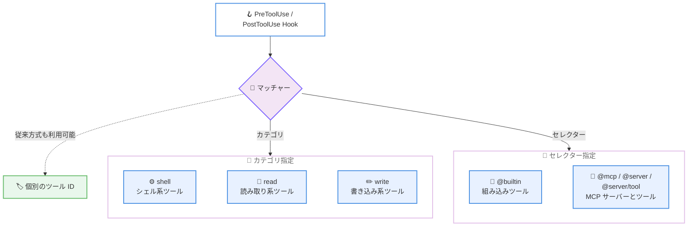

# Kiro - Workflows フィードバック、Powers 検索、柔軟な Hook マッチング (IDE 1.2.56)

**リリース日**: 2026 年 10 月 8 日
**サービス**: Kiro
**機能**: IDE 1.2.56 - Workflow Feedback, Power Search, and Flexible Hook Matching

📊 [このアップデートのインフォグラフィックを見る](https://takech9203.github.io/aws-news-summary/20261008-kiro-changelog-2026-10-08.html)

## 概要

AWS の AI 搭載 IDE である Kiro の IDE 1.2.56 がリリースされました。このリリースでは、Workflows のフィードバックリンクの追加、Available Powers ビューでの名前による検索、PreToolUse / PostToolUse Hook のカテゴリベースマッチングなどの改善が行われています。また、チャット、ターミナル、ソース管理に関する多数の問題が修正され、Workflow の信頼性、Spec 専用コマンドの表示、Hook マッチングが改善されています。

特に注目すべきは **柔軟な Hook マッチング** です。これまで PreToolUse / PostToolUse Hook でツールのグループを対象にするには、各ツール ID を個別に列挙する必要がありましたが、今回のアップデートで `shell`、`read`、`write` といったカテゴリや、`@builtin`、`@mcp`、`@server`、`@server/tool` といったセレクターでまとめて指定できるようになりました。これは CLI 2.28.0 で導入された V3 Hook のカテゴリマッチングと歩調を合わせた改善です。

修正面では、Workflow 実行が固定ブランチへ誘導される問題、`web_fetch` が URL のクエリ文字列やフラグメントを欠落させる問題、長いチャットセッションでのメモリ使用量増加によるエージェントのクラッシュなど、安定性とセキュリティに関わる 22 件の修正が含まれています。

**アップデート前の課題**

- PreToolUse / PostToolUse Hook でツールのグループを対象にするには、各ツール ID を個別に列挙する必要があった
- Available Powers ビューで目的の Power を探すには、カードを目視で探す必要があった
- `/quick-spec`、`/architecture-selection`、`/bug-fix` などの Spec 専用コマンドが Spec 以外のセッションでもコマンド一覧に表示され、一覧が煩雑だった
- セッション開始前に設定した Effort と Thinking がセッション開始時にリセットされていた
- Workflow 実行が固定ブランチへ誘導される、空のモデル応答でステップが作業なしに完了するなど、Workflow の信頼性に課題があった

**アップデート後の改善**

- Hook のマッチャーにカテゴリ (`shell`、`read`、`write`) とセレクター (`@builtin`、`@mcp`、`@server`、`@server/tool`) を指定し、ツールのグループをまとめて対象にできるようになった
- Available Powers ビューで名前によるカードのフィルタリングが可能になり、Power を素早く見つけられるようになった
- Spec 専用スラッシュコマンドは Spec セッションでのみ表示されるようになった
- 最初のメッセージ送信前に設定した Effort と Thinking が維持されるようになった
- デスクトップアプリのチャットの Workflows ドロワーからフィードバックサーベイを開けるようになった
- Workflow の多数の問題修正により、実行の信頼性が向上した

## アーキテクチャ図



PreToolUse / PostToolUse Hook のマッチャーが、個別のツール ID の列挙に加えて、カテゴリとセレクターによるグループ指定に対応したことを示しています。

## サービスアップデートの詳細

### 主要機能 (Improvements)

1. **Workflows のフィードバック共有**
   - デスクトップアプリのチャットの Workflows ドロワーから、短いフィードバックサーベイを開けるようになった
   - サーベイは GovCloud、AWS 分離リージョン、中国リージョンでは利用できない

2. **Available Powers の検索**
   - Available Powers ビューで、カードを名前でフィルタリングして Power を素早く見つけられるようになった

3. **Spec 専用スラッシュコマンド**
   - `/quick-spec`、`/architecture-selection`、`/bug-fix` が Spec セッションでのみ表示されるようになった
   - Spec 以外のセッションでコマンド一覧が煩雑になることがなくなった

4. **セッション開始時の Effort 維持**
   - 最初のメッセージを送る前に Effort と Thinking を設定した場合、セッション開始時にリセットされず、その選択が維持されるようになった

5. **Workflow 一覧の高速化**
   - 実行数が多い場合でも Workflows の一覧がより速く読み込まれるようになった

6. **柔軟な Hook マッチャー**
   - PreToolUse / PostToolUse Hook で、各ツール ID を列挙する代わりに、カテゴリとセレクター (`shell`、`read`、`write`、`@builtin`、`@mcp`、`@server`、`@server/tool`) でツールのグループをマッチできるようになった

### 主な修正 (Fixes)

**Workflow 関連**

- Workflow が固定ブランチへ誘導される問題を修正。各実行は開始時にチェックアウトされているブランチを使用するようになった
- 空のモデル応答で Workflow ステップが作業なしに完了する問題を修正。実行を一時停止する前に自動でリトライするようになった
- ターン終了直後に送信されたメッセージがそのターンを含まずにモデルへ届き、Workflow 実行の完了を Kiro が認識できなくなることがある問題を修正
- Workflow ステップの許可カードで「このセッションでは常に許可」が維持されず、ステップの呼び出し上限に達するまで確認が繰り返される問題を修正

**チャット・セッション関連**

- 同じセッションを別ウィンドウまたは Agent Focus で開いていると、実行中の応答の動作インジケーターが消える問題を修正
- チャットが自身のワークスペースフォルダーだけでなく、別の開いているチャットのワークスペースフォルダーからスキルやステアリングを読み込むことがある問題を修正
- 未応答のツール呼び出しを常に「ユーザーによって中断された」とモデルに伝えていた問題を修正。ツールが実行されなかったのか、結果を返したのか、結果が不明なのかを伝えるようになった
- ステアリングのスラッシュコマンドがプロンプトの先頭でのみ動作する問題を修正。空白が前にあればメッセージ内のどこでも動作するようになった
- プロンプトの開始中 (例: MCP サーバーの起動中) に Stop を押しても、モデルに到達するまで停止されない問題を修正
- 正常に終了したセッションが、再読み込み時に実行中として表示されることがある問題を修正
- ツール承認、Hook プロンプト、安全プロンプトへの応答が他のウィンドウや Agent Focus の Needs you パネルに反映されず、セッションが待機状態のままになる問題を修正
- 長いチャットセッションでメモリ使用量が増加し続け、エージェントがクラッシュすることがある問題を修正
- Find in Chat で一致箇所やチャット入力をクリックした後、Escape で閉じられない問題を修正

**ターミナル・ファイル関連**

- Windows でシェルの起動に失敗した際、ターミナルがカーソル点滅のみの空白パネルになる問題を修正。起動失敗と終了コードを表示するようになった
- Kiro に送られるコマンド出力に次のシェルプロンプトが含まれることがある問題と、起動しなかったコマンドが前のコマンドの出力を返す問題を修正
- UTF-16 やコードページ形式を含む非 UTF-8 エンコーディングのファイルが文字化けして読み込まれる問題を修正。検出したエンコーディングでデコードするようになった
- ステアリングドキュメントに `#[[file:...]]` 参照を追加した直後の編集が、次のスキャンまで反映されない問題を修正

**ソース管理関連**

- マルチリポジトリワークスペースで Generate Commit Message が誤ったリポジトリを使用する問題を修正。クリックしたリポジトリを使用し、コマンドパレットからは使用するリポジトリを確認するようになった
- セッション中にワークスペースフォルダーを追加・削除すると、View changes とファイルごとの View diff がセッションの変更を見つけられない問題を修正

**ツールと MCP 関連**

- `web_fetch` が URL のクエリ文字列とフラグメントを欠落させる問題を修正。HTTP の HTTPS への昇格と、URL に埋め込まれた認証情報の除去も行うようになった
- キャンセルされた stdio MCP サーバー接続のプロセスが残り続ける、または後から起動されることがある問題を修正
- セッション再読み込み後に UserPromptSubmit とクライアントホスト型コマンド Hook の出力がモデルのコンテキストから欠落する問題を修正

## 技術仕様

### Hook マッチャーのカテゴリとセレクター

| 指定方法 | 値 | 対象 |
|------|------|------|
| カテゴリ | `shell` | シェル実行系のツール |
| カテゴリ | `read` | 読み取り系のツール |
| カテゴリ | `write` | 書き込み系のツール |
| セレクター | `@builtin` | 組み込みツール全体 |
| セレクター | `@mcp` | すべての MCP ツール |
| セレクター | `@server` | 特定の MCP サーバーのツール |
| セレクター | `@server/tool` | 特定の MCP サーバーの特定のツール |

従来どおり個別のツール ID によるマッチングも引き続き使用できます。

### 今回の改善の対象範囲

| 項目 | 詳細 |
|------|------|
| 対象バージョン | Kiro IDE 1.2.56 |
| Hook マッチング | PreToolUse / PostToolUse Hook のカテゴリ・セレクター対応 |
| Spec 専用コマンド | `/quick-spec`、`/architecture-selection`、`/bug-fix` は Spec セッションのみに表示 |
| フィードバックサーベイ | デスクトップアプリの Workflows ドロワーから利用可能。GovCloud、AWS 分離リージョン、中国リージョンでは利用不可 |
| `web_fetch` の URL 処理 | クエリ文字列・フラグメントを保持。HTTP を HTTPS へ昇格し、埋め込み認証情報を除去 |
| ファイルエンコーディング | 非 UTF-8 ファイル (UTF-16、コードページ形式を含む) を検出したエンコーディングでデコード |

## 設定方法

### 前提条件

1. Kiro IDE 1.2.56 以降にアップデートしていること
2. Hook マッチングを利用する場合、PreToolUse / PostToolUse Hook を設定していること
3. Workflows のフィードバックサーベイを利用する場合、デスクトップアプリを使用していること

### 手順

#### ステップ 1: Kiro IDE をアップデートする

Kiro IDE を再起動するか、アップデート通知に従って 1.2.56 へアップデートします。アップデート後、今回の改善と修正がすべて有効になります。

#### ステップ 2: Hook マッチャーをカテゴリベースに書き換える

```json
{
  "hooks": {
    "preToolUse": [
      {
        "matcher": "shell",
        "command": "./scripts/validate-shell-command.sh"
      },
      {
        "matcher": "@mcp",
        "command": "./scripts/log-mcp-call.sh"
      }
    ]
  }
}
```

個別のツール ID を列挙していたマッチャーを、カテゴリ (`shell`、`read`、`write`) やセレクター (`@builtin`、`@mcp`、`@server`、`@server/tool`) に置き換えます。この例では、すべてのシェル系ツールの実行前に検証スクリプトを実行し、すべての MCP ツールの呼び出し前にログ記録を行います。詳細な記法は [Hook タイプのドキュメント](https://kiro.dev/docs/hooks/types/#pre-tool-use)を参照してください。

#### ステップ 3: Available Powers を検索する

Available Powers ビューを開き、検索フィールドに Power の名前を入力してカードをフィルタリングします。目的の Power を素早く見つけてインストールできます。

#### ステップ 4: Workflows のフィードバックを送信する

デスクトップアプリのチャットで Workflows ドロワーを開き、フィードバックリンクから短いサーベイに回答します。Workflows の改善に向けたフィードバックを開発チームへ直接届けられます。

## メリット

### ビジネス面

- **ガバナンスの効率化**: Hook のカテゴリマッチングにより、ツール単位ではなくグループ単位でポリシー (検証、ログ記録、ブロック) を適用でき、管理コストが削減される
- **フィードバックループの確立**: Workflows ドロワーからのサーベイにより、新機能である Workflows の改善要望を直接開発チームへ届けられる
- **安定性の向上**: メモリリークやセッション状態の問題など 22 件の修正により、長時間のエージェント作業の信頼性が向上する

### 技術面

- **保守性の高い Hook 設定**: 新しいツールが追加されてもカテゴリやセレクターでカバーされるため、ツール ID の列挙を更新し続ける必要がない
- **セキュリティの強化**: `web_fetch` が HTTP を HTTPS へ昇格し、URL に埋め込まれた認証情報を除去するようになり、意図しない情報漏えいのリスクが低減される
- **Workflow の信頼性向上**: ブランチの固定化、空応答によるステップ完了、許可カードの設定が維持されない問題などが修正され、バックグラウンド実行の確実性が高まった

## デメリット・制約事項

### 制限事項

- Workflows のフィードバックサーベイは GovCloud、AWS 分離リージョン、中国リージョンでは利用できない
- フィードバックサーベイはデスクトップアプリの Workflows ドロワーからのみ利用できる
- Spec 専用スラッシュコマンドは Spec セッション以外では表示されなくなるため、従来の表示に慣れたユーザーは注意が必要

### 考慮すべき点

- カテゴリやセレクターによる Hook マッチングは対象範囲が広がるため、意図しないツールにまで Hook が適用されないか確認が必要
- CLI 側では 2.28.0 で V3 Hook のカテゴリマッチングが導入されており、IDE と CLI の両方で Hook を運用している場合は双方の設定を見直すとよい
- `web_fetch` の URL 処理変更により、HTTP 限定のエンドポイントや URL 埋め込み認証情報に依存していたワークフローは動作が変わる可能性がある

## ユースケース

### ユースケース 1: シェル実行全体へのガードレール適用

**シナリオ**: 組織のポリシーとして、エージェントが実行するすべてのシェルコマンドを事前検証したい。従来はシェル系ツールの ID を個別に列挙しており、ツールの追加のたびに設定更新が必要だった。

**実装例**:
```json
{
  "hooks": {
    "preToolUse": [
      {
        "matcher": "shell",
        "command": "./scripts/validate-command.sh"
      }
    ]
  }
}
```

**効果**: カテゴリ `shell` の指定だけですべてのシェル系ツールが対象になり、ツール ID の列挙と継続的なメンテナンスが不要になる。

### ユースケース 2: 特定の MCP サーバーの監査ログ記録

**シナリオ**: 社内データにアクセスする特定の MCP サーバーについて、ツール呼び出しの監査ログを残したい。

**実装例**:
```json
{
  "hooks": {
    "postToolUse": [
      {
        "matcher": "@internal-data-server",
        "command": "./scripts/audit-log.sh"
      }
    ]
  }
}
```

**効果**: `@server` セレクターで対象サーバーのすべてのツール呼び出しを捕捉でき、サーバーにツールが追加されても監査対象から漏れない。

### ユースケース 3: Workflow によるブランチごとの並行作業

**シナリオ**: 複数のブランチで Workflow を使った修正作業を並行して進めたいが、従来は Workflow 実行が固定ブランチへ誘導されることがあった。

**実装例**:
```
1. 作業対象のブランチをチェックアウトする
2. チャットから Workflow 実行を開始する
3. 各実行は開始時にチェックアウトされていたブランチを使用する
```

**効果**: 各 Workflow 実行が開始時のブランチを尊重するため、ブランチごとの並行作業を安心して任せられる。

## 利用可能リージョン

Kiro はグローバルに利用可能なサービスです。今回のアップデートは Kiro IDE 1.2.56 で利用できます。なお、Workflows のフィードバックサーベイは GovCloud、AWS 分離リージョン、中国リージョンでは利用できません。

## 関連サービス・機能

- **Kiro Workflows**: 再利用可能な複数ステップのエージェントプランをバックグラウンドで実行する機能。今回のアップデートでフィードバックリンクの追加と信頼性の改善が行われた
- **Kiro Powers**: Kiro の機能を拡張するパッケージ。Available Powers ビューでの名前検索が可能になった
- **Kiro Hooks**: ツール実行の前後に処理を差し込む仕組み。カテゴリとセレクターによるグループマッチングに対応した
- **Kiro CLI 2.28.0**: V3 セッションの Hook にカテゴリマッチングを導入した CLI 側のアップデート。IDE 1.2.56 の Hook マッチング改善と対応する

## 参考リンク

- 📊 [インフォグラフィック](https://takech9203.github.io/aws-news-summary/20261008-kiro-changelog-2026-10-08.html)
- [Kiro Changelog](https://kiro.dev/changelog/)
- [Kiro Changelog - IDE 1.2.56](https://kiro.dev/changelog/ide/1-2-56/)
- [Kiro ドキュメント - Hook タイプ](https://kiro.dev/docs/hooks/types/#pre-tool-use)
- [Kiro ドキュメント - Powers のインストール](https://kiro.dev/docs/powers/installation/#from-the-ide)
- [Kiro ドキュメント - スラッシュコマンド](https://kiro.dev/docs/ide/chat/slash-commands/)
- [Kiro ドキュメント - Workflows](https://kiro.dev/docs/workflows/)

## まとめ

Kiro IDE 1.2.56 は、Hook のカテゴリ・セレクターマッチングによるガバナンス設定の簡素化と、Workflow、チャット、ターミナル、ソース管理にわたる 22 件の修正による安定性向上が中心のアップデートです。個別のツール ID を列挙している既存の Hook 設定は、`shell` や `@mcp` などのカテゴリ・セレクターへの移行を検討することを推奨します。Workflows を利用しているユーザーは、ドロワーのフィードバックリンクから改善要望を送ることで、機能の発展に貢献できます。
