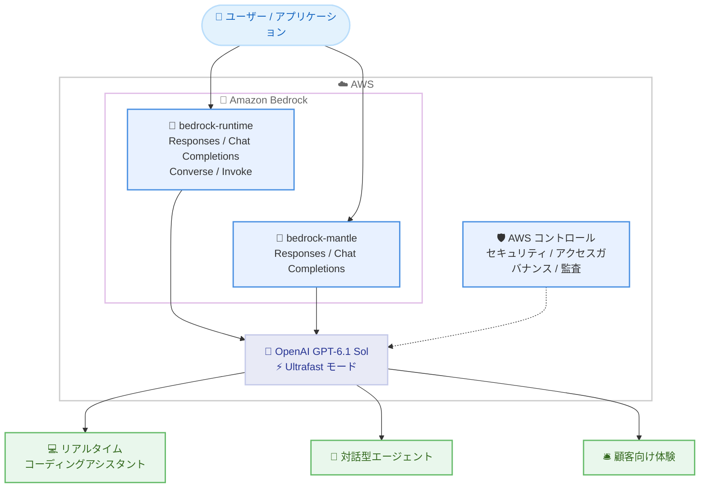

# Amazon Bedrock - OpenAI GPT-6.1 Sol の Ultrafast モード対応

**リリース日**: 2026 年 10 月 8 日
**サービス**: Amazon Bedrock
**機能**: OpenAI GPT-6.1 Sol の Ultrafast モード提供開始

📊 [このアップデートのインフォグラフィックを見る](https://takech9203.github.io/aws-news-summary/20261008-openai-gpt-sol-ultrafast-amazon.html)

## 概要

Amazon Bedrock 上の OpenAI GPT-6.1 Sol モデルで、Ultrafast モードが利用可能になりました。Ultrafast モードは、速度が最も重要なワークロードに対してより高速な推論を提供するモードです。リアルタイムコーディングアシスタント、対話型エージェント、顧客向け体験など、レイテンシーに敏感なアプリケーションでの利用が推奨されています。

GPT-6.1 Sol は、性能とコストの両方が重要なワークロード向けの OpenAI のモデルで、エージェントによるコードベースの調査と解決策の反復、複雑なドキュメントの理解、複数ステップにわたるビジネスワークフローやコンピュータ操作ワークフローの完遂を支援します。1M トークンのコンテキストウィンドウと最大 131,072 トークンの出力に対応し、2026 年 9 月 29 日に Amazon Bedrock で提供開始されました。今回の Ultrafast モード対応により、開発者による機能実装、デバッグ、複雑なコードベースの探索、マルチステップワークフローといった速度重視のユースケースで、迅速かつ高品質な応答を得られるようになります。

Amazon Bedrock の推論エンジンが本番利用に必要なパフォーマンス、セキュリティ、信頼性を提供し、AWS のコントロールがワークロードのセキュリティ、アクセスガバナンス、モデル呼び出しの監査をサポートします。Amazon Bedrock コンソールまたはサポートされている Amazon Bedrock API からプログラムで利用を開始できます。

**アップデート前の課題**

- GPT-6.1 Sol は Standard サービスティアのみの提供で、Priority ティアや Flex ティアは非対応のため、応答速度を高める選択肢が限られていた
- リアルタイムコーディングアシスタントや対話型エージェントなど、レイテンシーに敏感なワークロードでは、推論速度がユーザー体験のボトルネックになり得た
- 顧客向け体験で迅速な応答が求められる場合、より小型のモデルを選択するなど、品質と速度のトレードオフを迫られることがあった

**アップデート後の改善**

- Ultrafast モードにより、GPT-6.1 Sol の品質を活かしながら、速度が最も重要なワークロードでより高速な推論が可能になった
- リアルタイムコーディングアシスタント、対話型エージェント、顧客向け体験といったレイテンシーに敏感なアプリケーションに GPT-6.1 Sol を適用しやすくなった
- Amazon Bedrock の推論エンジン上で提供されるため、セキュリティ、アクセスガバナンス、モデル呼び出しの監査といった AWS のコントロールを維持したまま高速推論を利用できる

## アーキテクチャ図



アプリケーションは Amazon Bedrock のエンドポイント経由で GPT-6.1 Sol を呼び出し、Ultrafast モードによる高速推論を、AWS のセキュリティ・ガバナンス・監査のコントロールを維持したまま、レイテンシーに敏感なユースケースに適用できます。

## サービスアップデートの詳細

### 主要機能

1. **Ultrafast モードによる高速推論**
   - 速度が最も重要なワークロード向けに、より高速な推論を提供
   - リアルタイムコーディングアシスタント、対話型エージェント、顧客向け体験などのレイテンシーに敏感なアプリケーションでの利用を想定
   - Amazon Bedrock コンソールまたはサポートされている Amazon Bedrock API から利用可能

2. **GPT-6.1 Sol のエージェント・コーディング能力**
   - エージェントによるコードベースの調査と解決策の反復に対応
   - 複雑なドキュメントの理解や、複数ステップにわたるビジネス・コンピュータ操作ワークフローの完遂を支援
   - 機能実装、デバッグ、複雑なコードベースの探索、マルチステップワークフローなど開発者の作業を支援

3. **Amazon Bedrock のエンタープライズ基盤**
   - Amazon Bedrock の推論エンジンが本番利用に必要なパフォーマンス、セキュリティ、信頼性を提供
   - AWS のコントロールにより、ワークロードのセキュリティ、アクセスガバナンス、モデル呼び出しの監査をサポート
   - 呼び出しログ、レスポンスストリーミング、Guardrails (Chat Completions / InvokeModel / Converse API)、プロンプトキャッシュ、構造化出力などの Bedrock 機能と組み合わせて利用可能

## 技術仕様

### GPT-6.1 Sol モデル仕様

| 項目 | 詳細 |
|------|------|
| プロバイダー | OpenAI |
| モデル ID | `openai.gpt-6.1-sol` |
| 推論プロファイル | `us.openai.gpt-6.1-sol` (US Geo)、`global.openai.gpt-6.1-sol` (Global) |
| コンテキストウィンドウ | 1M トークン |
| 最大出力トークン | 131,072 トークン |
| 入力モダリティ | テキスト、画像 |
| 出力モダリティ | テキスト |
| 対応エンドポイント | bedrock-runtime、bedrock-mantle |
| 対応 API | Responses / Chat Completions / Converse / Invoke (bedrock-runtime)、Responses / Chat Completions (bedrock-mantle) |
| サービスティア | Standard のみ (Priority / Flex / Reserved は非対応) |
| プロンプトキャッシュ | 暗黙的・明示的の両方に対応 (明示的キャッシュの TTL は 30 分のみ、最小 1,024 トークン、リクエストあたり最大 4 キャッシュ書き込み) |
| モデルリリース日 | 2026 年 9 月 29 日 |
| 出力トークンのバーンダウンレート | 10 (出力 1 トークンがクォータ 10 トークンを消費) |

### API 変更履歴

今回のアップデートに関連する Amazon Bedrock Runtime の API 変更は、awsapichanges.com の直近の変更履歴 (過去 10 日間) では確認されていません。Ultrafast モードの具体的な利用方法 (リクエストパラメーターなど) は、[GPT-6.1 Sol モデルカード](https://docs.aws.amazon.com/bedrock/latest/userguide/model-card-openai-gpt-6-1-sol.html)の最新情報を参照してください。

## 設定方法

### 前提条件

1. AWS アカウントと Amazon Bedrock へのアクセス権限
2. Amazon Bedrock API キーまたは IAM 認証情報
3. OpenAI SDK を利用する場合は Python 環境と `openai` パッケージ

### 手順

#### ステップ 1: コンソールでの動作確認

Amazon Bedrock コンソールで GPT-6.1 Sol を選択し、プロンプトを送信して動作を確認します。What's New によると、Ultrafast モードは Amazon Bedrock コンソールから利用を開始できます。

#### ステップ 2: 環境変数の設定

```bash
export OPENAI_API_KEY="<Bedrock API キー>"
export OPENAI_BASE_URL="https://bedrock-runtime.us-east-1.amazonaws.com/openai/v1"
```

OpenAI SDK から Amazon Bedrock を呼び出すための認証情報とエンドポイントを設定します。bedrock-mantle エンドポイントを利用する場合は `https://bedrock-mantle.us-east-1.api.aws/openai/v1` を指定します。

#### ステップ 3: Responses API での呼び出し

```python
from openai import OpenAI

client = OpenAI()

response = client.responses.create(
    model="us.openai.gpt-6.1-sol",
    input="Amazon Bedrock の特徴を説明してください。",
    max_output_tokens=512,
)
print(response.output_text)
```

OpenAI SDK の Responses API で GPT-6.1 Sol を呼び出します。bedrock-runtime エンドポイントではインリージョン呼び出しは非対応のため、US Geo クロスリージョン推論の場合は `us.openai.gpt-6.1-sol`、Global クロスリージョン推論の場合は `global.openai.gpt-6.1-sol` を model に指定します。Ultrafast モードを有効化する具体的なパラメーターは、モデルカードの最新情報で確認してください。

## メリット

### ビジネス面

- **顧客体験の向上**: 顧客向けアプリケーションで迅速かつ高品質な応答を提供でき、ユーザー体験と満足度の向上につながる
- **高品質モデルの適用範囲拡大**: これまで速度要件により適用が難しかったレイテンシーに敏感な業務に、GPT-6.1 Sol クラスのモデルを適用できる
- **ガバナンスの維持**: AWS のコントロールによるセキュリティ、アクセスガバナンス、監査を維持したまま高速推論を導入できる

### 技術面

- **低レイテンシー推論**: 速度が最も重要なワークロードに対して、より高速な推論を利用できる
- **リアルタイムエージェント対応**: リアルタイムコーディングアシスタントや対話型エージェントなど、応答速度がボトルネックになりやすいエージェントワークロードに適合する
- **既存機能との併用**: プロンプトキャッシュ (キャッシュ読み取りは非キャッシュ入力単価の 0.05 倍) や構造化出力など、Bedrock の既存機能と組み合わせてレイテンシーとコストをさらに最適化できる

## デメリット・制約事項

### 制限事項

- GPT-6.1 Sol のインリージョン推論は bedrock-mantle エンドポイントの us-east-1 (バージニア北部) のみで、bedrock-runtime エンドポイントではクロスリージョン推論プロファイル (US Geo または Global) の利用が必要
- GPT-6.1 Sol のサービスティアは Standard のみで、Priority / Flex / Reserved ティアは非対応
- サーバーサイドシステムツール、インテリジェントプロンプトルーティング、トークンカウント、Knowledge Bases、プロンプト最適化は GPT-6.1 Sol では非対応
- Guardrails は Responses API では非対応 (Chat Completions / InvokeModel / Converse API では対応)

### 考慮すべき点

- What's New では Ultrafast モードの対応リージョン、料金、有効化パラメーターの詳細は明記されておらず、ドキュメント ([GPT-6.1 Sol モデルカード](https://docs.aws.amazon.com/bedrock/latest/userguide/model-card-openai-gpt-6-1-sol.html)) で最新情報を確認する必要がある
- 本レポート作成時点で取得したモデルカードおよびサービスティアのドキュメントには Ultrafast モードの詳細 (有効化方法・料金) が記載されていないため、利用前にドキュメントの更新を確認することを推奨
- 入力が 272,000 トークンを超えるリクエストには、リクエスト全体に長コンテキスト料金が適用される

## ユースケース

### ユースケース 1: リアルタイムコーディングアシスタント

**シナリオ**: IDE やコーディングエージェントに組み込んだ AI アシスタントで、機能実装、デバッグ、複雑なコードベースの探索をリアルタイムに支援したい。

**実装例**:
```text
1. Amazon Bedrock で GPT-6.1 Sol へのアクセスを設定
2. OpenAI SDK の Responses API から us.openai.gpt-6.1-sol を呼び出し
3. Ultrafast モードを利用して応答レイテンシーを短縮
4. 明示的プロンプトキャッシュでコードベースのコンテキストを再利用
```

**効果**: 開発者の思考を妨げない応答速度でコーディング支援を提供でき、1M トークンのコンテキストを活かした大規模コードベースの探索と高速応答を両立できる。

### ユースケース 2: 対話型エージェント

**シナリオ**: 複数ステップのワークフローを自律的に処理する対話型エージェントで、ユーザーとのインタラクションの待ち時間を最小化したい。

**実装例**:
```text
1. エージェントフレームワークのモデルに GPT-6.1 Sol を指定
2. Ultrafast モードで各ステップの推論レイテンシーを短縮
3. レスポンスストリーミングで途中経過を逐次表示
4. 構造化出力 (JSON Schema) でツール呼び出し結果を安定的に処理
```

**効果**: マルチステップワークフローの各ステップが高速化され、エージェント全体の応答時間を短縮し、対話体験を損なわずに複雑なタスクを自動化できる。

### ユースケース 3: 顧客向けアプリケーションの応答生成

**シナリオ**: カスタマーサポートや EC サイトなどの顧客向けアプリケーションで、迅速かつ高品質な応答を提供したい。

**実装例**:
```text
1. アプリケーションのバックエンドから Bedrock API を呼び出し
2. Ultrafast モードで顧客への初回応答までの時間を短縮
3. Guardrails (Converse API 経由) で入出力の安全性を担保
4. 呼び出しログと CloudTrail で監査要件に対応
```

**効果**: 顧客の離脱につながりやすい応答待ち時間を短縮しながら、AWS のガバナンス・監査のコントロールを維持した運用ができる。

## 料金

GPT-6.1 Sol はトークン単位の従量課金です。モデルカードに記載されている Standard ティアの料金 (100 万トークンあたり、米ドル、短コンテキスト: 入力 272K トークン以下) は以下のとおりです。入力が 272,000 トークンを超える場合はリクエスト全体に長コンテキスト料金が適用されます。Ultrafast モード固有の料金は What's New では明記されていないため、最新の料金は[モデルカード](https://docs.aws.amazon.com/bedrock/latest/userguide/model-card-openai-gpt-6-1-sol.html)および [Amazon Bedrock 料金ページ](https://aws.amazon.com/bedrock/pricing/)を参照してください。

### 料金例 (Standard ティア、短コンテキスト)

| 推論オプション | 入力 | 入力 - キャッシュ書き込み | 入力 - キャッシュ読み取り | 出力 |
|----------------|------|---------------------------|---------------------------|------|
| Regional (bedrock-mantle、us-east-1) | $2.20 | $2.75 | $0.11 | $11.00 |
| US CRIS (bedrock-runtime) | $2.20 | $2.75 | $0.11 | $11.00 |
| Global CRIS (bedrock-runtime) | $2.00 | $2.50 | $0.10 | $10.00 |

## 利用可能リージョン

GPT-6.1 Sol は、bedrock-mantle エンドポイントでは us-east-1 (バージニア北部) のインリージョン推論、bedrock-runtime エンドポイントでは US Geo クロスリージョン推論 (`us.openai.gpt-6.1-sol`) および Global クロスリージョン推論 (`global.openai.gpt-6.1-sol`) で利用できます。US Geo 推論のソースリージョンには、米国の各リージョンに加えてカナダ (ca-central-1、ca-west-1) も含まれます。Ultrafast モードが利用可能なリージョンの詳細は、[モデルカード](https://docs.aws.amazon.com/bedrock/latest/userguide/model-card-openai-gpt-6-1-sol.html)で確認してください。

## 関連サービス・機能

- **Amazon Bedrock クロスリージョン推論**: US Geo / Global 推論プロファイルにより、リージョン間でリクエストをルーティングしてスループットを確保
- **Amazon Bedrock プロンプトキャッシュ**: 暗黙的・明示的キャッシュにより、繰り返し利用するプロンプトのレイテンシーとコストを削減。Ultrafast モードと組み合わせた高速化に有効
- **Amazon Bedrock Guardrails**: Chat Completions / InvokeModel / Converse API 経由で入出力の安全性を担保
- **Amazon Bedrock サービスティア**: Standard / Priority / Flex / Reserved の各ティアでレイテンシーとコストを調整する既存の仕組み (GPT-6.1 Sol は Standard のみ対応)
- **構造化出力 (JSON Schema)**: Responses / Chat Completions / InvokeModel / Converse API でモデル応答の形式を制御

## 参考リンク

- 📊 [インフォグラフィック](https://takech9203.github.io/aws-news-summary/20261008-openai-gpt-sol-ultrafast-amazon.html)
- [公式発表 (What's New)](https://aws.amazon.com/about-aws/whats-new/2026/10/openai-gpt-sol-ultrafast-amazon/)
- [ドキュメント: GPT-6.1 Sol モデルカード](https://docs.aws.amazon.com/bedrock/latest/userguide/model-card-openai-gpt-6-1-sol.html)
- [ドキュメント: Amazon Bedrock サービスティア](https://docs.aws.amazon.com/bedrock/latest/userguide/service-tiers-inference.html)
- [料金ページ](https://aws.amazon.com/bedrock/pricing/)

## まとめ

Amazon Bedrock 上の OpenAI GPT-6.1 Sol で Ultrafast モードが利用可能になり、リアルタイムコーディングアシスタント、対話型エージェント、顧客向け体験といったレイテンシーに敏感なワークロードに、高品質なモデルを高速推論で適用できるようになりました。レイテンシーが課題となっている生成 AI アプリケーションでは、まず Bedrock コンソールで GPT-6.1 Sol の応答速度を評価することを推奨します。Ultrafast モードの有効化方法、対応リージョン、料金の詳細はモデルカードの最新情報を確認してください。
