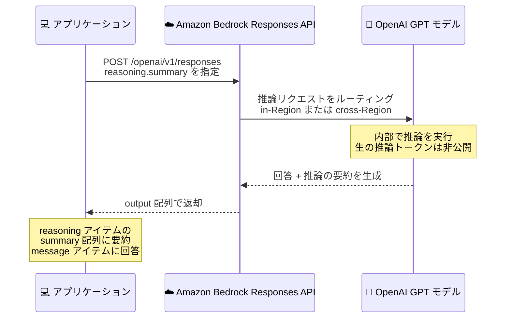

# Amazon Bedrock - OpenAI モデルの推論サマリー (Reasoning Summaries) サポート

**リリース日**: 2026 年 10 月 9 日
**サービス**: Amazon Bedrock
**機能**: Responses API における OpenAI モデルの reasoning.summary パラメータサポート

📊 [このアップデートのインフォグラフィックを見る](https://takech9203.github.io/aws-news-summary/20261009-amazon-bedrock-reasoning-summaries-openai.html)

## 概要

Amazon Bedrock が、Responses API を通じて OpenAI モデルの `reasoning.summary` パラメータをサポートしました。このパラメータを指定すると、モデルの最終回答に加えて、モデルがどのように推論したかを人間が読める形式で要約した「推論サマリー」を取得できます。

推論サマリーにより、コーディング、分析、マルチステップの問題解決といった複雑なタスクに対して、モデルがどのようにアプローチしたかを理解できます。開発者はこの追加コンテキストを、レスポンスの評価、アプリケーションのデバッグ、エンドユーザーへのモデルのアプローチの説明に活用できます。要約は、モデルの回答とともにレスポンスの `reasoning` 出力アイテム内の `summary` 配列で返されます。

OpenAI の推論モデルでは、生の推論トークン (raw reasoning tokens) は API 経由で公開されません。推論サマリーはオプトイン方式であり、パラメータを指定した場合のみ、推論過程の要約がレスポンスに含まれます。

**アップデート前の課題**

Amazon Bedrock 上で OpenAI の推論モデルを利用する際、以下の課題がありました。

- モデルの推論過程がブラックボックスであり、最終回答のみしか取得できなかった
- 複雑なタスクで期待と異なる回答が返された場合、モデルがどのような思考プロセスを辿ったかを確認する手段がなく、デバッグが困難だった
- エンドユーザーに対して、モデルがどのように結論へ至ったかを説明する材料がなかった

**アップデート後の改善**

今回のアップデートにより、以下が可能になりました。

- `reasoning.summary` パラメータを指定するだけで、推論過程の人間が読める要約を回答とあわせて取得できるようになった
- 推論サマリーを参照してレスポンスの品質評価やアプリケーションのデバッグが行えるようになった
- モデルのアプローチをエンドユーザーに提示し、回答の透明性と信頼性を高められるようになった

## アーキテクチャ図



アプリケーションが `reasoning.summary` パラメータ付きで Responses API を呼び出すと、モデルの最終回答 (`message` アイテム) に加えて、推論過程の要約 (`reasoning` アイテムの `summary` 配列) が返却される流れを示しています。

## サービスアップデートの詳細

### 主要機能

1. **推論サマリーの取得**
   - リクエストの `reasoning` オブジェクト内に `summary` パラメータを指定することで有効化
   - モデルの思考プロセスを人間が読める形式で要約して返却
   - オプトイン方式のため、指定しない場合は従来どおり回答のみが返される

2. **summary パラメータの指定値**
   - `auto`: モデルがサポートする最も詳細なサマライザーを自動選択 (多くの推論モデルでは `detailed` と同等)
   - `concise`: 短い要約 (一部のモデルでサポート)
   - `detailed`: 詳細な要約
   - サポートされる値はモデルごとに異なるため、モデルのドキュメントで確認が必要

3. **レスポンス形式**
   - 要約はレスポンスの `output` 配列内にある `type: "reasoning"` の出力アイテムに含まれる
   - `summary` 配列の各要素は `type: "summary_text"` と要約テキスト `text` を持つ
   - 最終回答は同じ `output` 配列内の `type: "message"` アイテムとして返される

4. **幅広い推論方式での利用**
   - in-Region 推論、地理的 (GEO) cross-Region 推論、global cross-Region 推論のすべてで利用可能
   - Amazon Bedrock 上のすべての OpenAI モデルで提供

## 技術仕様

### reasoning.summary パラメータ

| 項目 | 詳細 |
|------|------|
| 対象 API | Responses API (`POST /openai/v1/responses` など) |
| パラメータ | `reasoning.summary` |
| 指定値 | `auto` / `concise` / `detailed` (モデルによりサポート状況が異なる) |
| 返却場所 | `output` 配列内の `reasoning` 出力アイテムの `summary` 配列 |
| デフォルト動作 | 未指定の場合、要約は返却されない (オプトイン) |
| 生の推論トークン | API では公開されない (要約のみ取得可能) |

### Amazon Bedrock の Responses API エンドポイント

| エンドポイント | ベース URL | 用途 |
|------|------|------|
| bedrock-runtime (推奨) | `https://bedrock-runtime.{region}.amazonaws.com/openai/v1` | 新規アプリケーション |
| bedrock-mantle (互換) | `https://bedrock-mantle.{region}.api.aws/v1` | bedrock-runtime で未対応のモデルや機能が必要な場合 |

### リクエスト・レスポンス例

リクエスト例。

```json
{
  "model": "global.openai.gpt-5.6-sol",
  "input": "この Python コードのバグを特定して修正してください",
  "reasoning": {
    "effort": "medium",
    "summary": "auto"
  }
}
```

レスポンスの `output` 配列の例。

```json
[
  {
    "id": "rs_...",
    "type": "reasoning",
    "summary": [
      {
        "type": "summary_text",
        "text": "**コードの構造を確認** まずループ条件を分析し..."
      }
    ]
  },
  {
    "id": "msg_...",
    "type": "message",
    "status": "completed",
    "role": "assistant",
    "content": [
      { "type": "output_text", "text": "バグはループの境界条件にあります..." }
    ]
  }
]
```

## 設定方法

### 前提条件

1. Amazon Bedrock で OpenAI GPT モデルへのアクセスが有効化されていること
2. 認証情報の準備 (OpenAI SDK を使用する場合は Amazon Bedrock API キーが必要)
3. OpenAI SDK を使用する場合は SDK をインストールし、環境変数を設定すること

### 手順

#### ステップ 1: 環境変数の設定

```bash
export OPENAI_BASE_URL="https://bedrock-runtime.us-east-1.amazonaws.com/openai/v1"
export OPENAI_API_KEY="<Amazon Bedrock API キー>"
```

OpenAI SDK の接続先を Amazon Bedrock のエンドポイントに向け、認証に Amazon Bedrock API キーを使用するよう設定しています。OpenAI の API キーやエンドポイントではなく、必ず Amazon Bedrock のものを指定します。

#### ステップ 2: reasoning.summary を指定してリクエスト

```python
from openai import OpenAI

client = OpenAI()

response = client.responses.create(
    model="global.openai.gpt-5.6-sol",
    input="売上データの傾向を分析し、来四半期の施策を 3 つ提案してください",
    reasoning={"effort": "medium", "summary": "auto"},
)
print(response)
```

`reasoning` オブジェクトに `summary: "auto"` を指定して Responses API を呼び出しています。`model` には cross-Region 推論プロファイル ID (`global.` や `us.` プレフィックス付き) を指定します。

#### ステップ 3: レスポンスから推論サマリーを抽出

```python
for item in response.output:
    if item.type == "reasoning":
        for s in item.summary:
            print("推論サマリー:", s.text)
    elif item.type == "message":
        for c in item.content:
            print("回答:", c.text)
```

レスポンスの `output` 配列を走査し、`reasoning` アイテムの `summary` 配列から推論サマリーを、`message` アイテムから最終回答をそれぞれ取り出しています。

## メリット

### ビジネス面

- **透明性の向上**: モデルがどのように結論へ至ったかをエンドユーザーに提示でき、AI を活用したサービスの信頼性を高められる
- **説明責任への対応**: 金融や医療など説明可能性が求められる業界で、モデルのアプローチを記録・提示する材料として活用できる
- **品質評価の効率化**: 回答の良し悪しだけでなく推論過程も評価対象にできるため、プロンプトやモデル選定の改善サイクルを短縮できる

### 技術面

- **デバッグの容易化**: 期待と異なる回答が返された際、推論サマリーからモデルの思考プロセスを確認し、プロンプトの問題点を特定しやすくなる
- **実装の簡便さ**: リクエストにパラメータを 1 つ追加するだけで利用でき、既存の OpenAI SDK コードベースとの互換性も維持される
- **柔軟な推論方式**: in-Region、GEO cross-Region、global cross-Region のいずれの推論方式でも利用できる

## デメリット・制約事項

### 制限事項

- 返却されるのは推論過程の「要約」であり、生の推論トークンそのものは API 経由では公開されない
- `concise` / `detailed` などのサポート状況はモデルごとに異なるため、利用前にモデルのドキュメントでの確認が必要
- 推論トークンはレスポンスに表示されなくてもコンテキストを消費し、出力トークンとして課金される

### 考慮すべき点

- 推論サマリーをエンドユーザーに表示する場合、要約内容が意図せず内部情報を含まないかアプリケーション側での確認が推奨される
- bedrock-runtime エンドポイントで OpenAI GPT モデルを利用する場合、モデル ID にはシステム定義の推論プロファイル (`us.openai.*` や `global.openai.*` など) を指定する必要がある
- データレジデンシー要件がある場合は、global 推論プロファイルではなく地理的推論プロファイルの使用が推奨される

## ユースケース

### ユースケース 1: コーディングアシスタントのデバッグ支援

**シナリオ**: 社内開発者向けのコード生成アシスタントで、生成されたコードが要件を満たさないケースが散発しており、原因の切り分けに時間がかかっている。

**実装例**:
```python
response = client.responses.create(
    model="global.openai.gpt-5.6-sol",
    input=f"次の要件を満たす関数を実装してください: {requirements}",
    reasoning={"effort": "high", "summary": "detailed"},
)
```

**効果**: 推論サマリーからモデルが要件のどこを誤解したかを特定でき、プロンプト改善の根拠を得られる。デバッグ時間の短縮につながる。

### ユースケース 2: 分析レポート生成の品質評価

**シナリオ**: ビジネスデータの分析レポートを自動生成するアプリケーションで、分析の根拠が妥当かをレビュー担当者が確認したい。

**実装例**:
```python
response = client.responses.create(
    model="us.openai.gpt-5.6-sol",
    input="添付の売上データから地域別の傾向を分析してください",
    reasoning={"summary": "auto"},
)
# 推論サマリーをレビュー画面に表示
```

**効果**: 最終的な分析結果だけでなく、どのデータに着目しどのような手順で分析したかを確認でき、レビューの精度と効率が向上する。

### ユースケース 3: エンドユーザー向けの回答根拠の提示

**シナリオ**: カスタマーサポート向けのマルチステップ問題解決アシスタントで、提案した解決策の根拠をユーザーに示して納得感を高めたい。

**実装例**:
```python
response = client.responses.create(
    model="global.openai.gpt-5.6-sol",
    input=f"ユーザーの問い合わせ: {ticket_text} に対する解決手順を提案してください",
    reasoning={"summary": "concise"},
)
# summary 配列の内容を「この提案の考え方」として UI に表示
```

**効果**: 解決策とあわせてモデルのアプローチを簡潔に提示でき、ユーザーの納得感と自己解決率の向上が期待できる。

## 料金

推論サマリー機能自体への追加料金の記載はありません。Amazon Bedrock の OpenAI モデル利用料金は、入力トークンと出力トークンに基づく従量課金です。

なお、推論モデルの内部的な推論トークンは、レスポンスに表示されない場合でも出力トークンとして課金される点に注意が必要です。詳細は [Amazon Bedrock 料金ページ](https://aws.amazon.com/bedrock/pricing/) を参照してください。

## 利用可能リージョン

OpenAI GPT モデルが利用可能なすべての AWS リージョンで利用できます。以下の推論方式が対象です。

- in-Region 推論
- 地理的 (GEO) cross-Region 推論
- global cross-Region 推論

## 関連サービス・機能

- **Amazon Bedrock Responses API**: 本機能の提供基盤。ステートフルな会話管理、ストリーミング、マルチターン対話をサポートする OpenAI 互換 API
- **Amazon Bedrock cross-Region 推論**: 推論リクエストを複数リージョンへルーティングする機能。推論サマリーは GEO / global cross-Region 推論でも利用可能
- **Amazon Bedrock Guardrails**: Responses API と組み合わせて利用でき、推論サマリーを含むアプリケーションにも安全性の制御を適用可能

## 参考リンク

- 📊 [インフォグラフィック](https://takech9203.github.io/aws-news-summary/20261009-amazon-bedrock-reasoning-summaries-openai.html)
- [公式発表 (What's New)](https://aws.amazon.com/about-aws/whats-new/2026/10/amazon-bedrock-reasoning-summaries-openai/)
- [Amazon Bedrock Responses API ドキュメント](https://docs.aws.amazon.com/bedrock/latest/userguide/inference-responses-api.html)
- [OpenAI Reasoning Summaries ガイド](https://developers.openai.com/api/docs/guides/reasoning#reasoning-summaries)
- [Amazon Bedrock スタートガイド](https://docs.aws.amazon.com/bedrock/latest/userguide/getting-started.html)
- [Amazon Bedrock 料金ページ](https://aws.amazon.com/bedrock/pricing/)

## まとめ

Amazon Bedrock の Responses API で `reasoning.summary` パラメータがサポートされ、OpenAI モデルの推論過程を人間が読める要約として取得できるようになりました。パラメータを 1 つ追加するだけで、レスポンスの評価、デバッグ、エンドユーザーへの説明に活用できる強力なコンテキストが得られます。OpenAI モデルを Bedrock で利用している場合は、まず開発環境で `summary: "auto"` を指定し、推論サマリーの内容と活用方法を確認することを推奨します。
