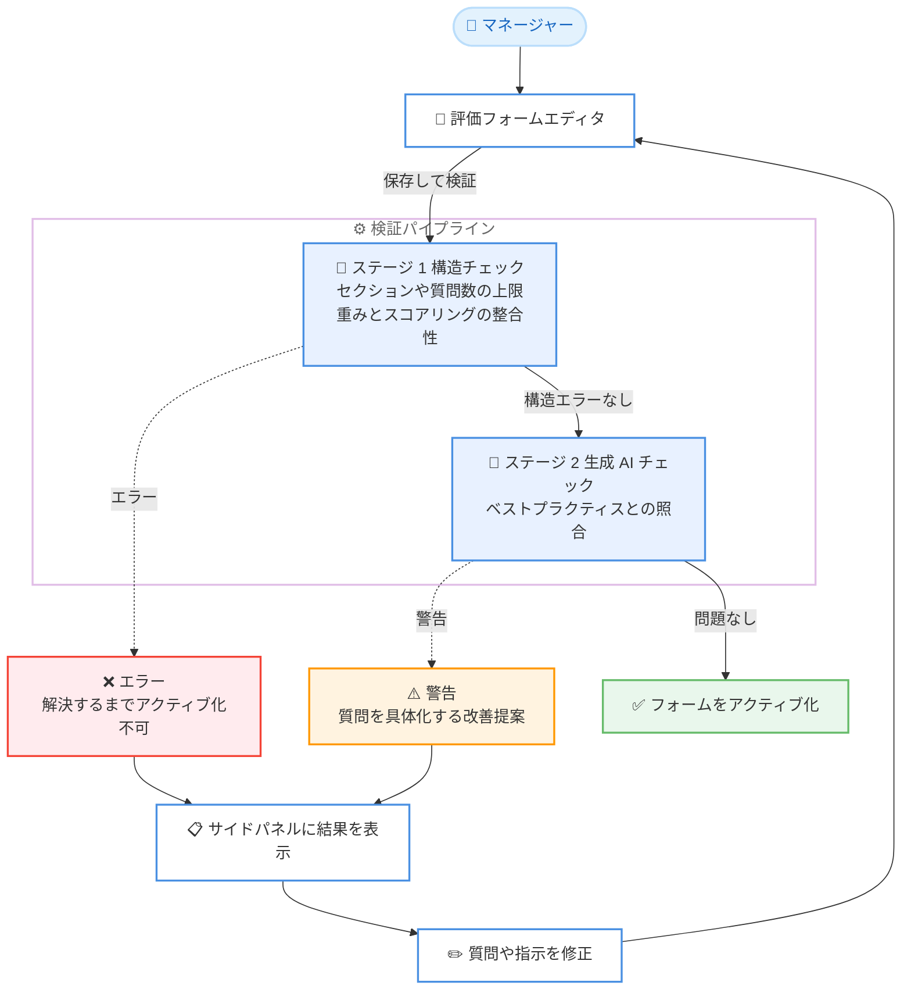

# Amazon Connect Customer - パフォーマンス評価フォームの自動チェック機能

**リリース日**: 2026 年 10 月 9 日
**サービス**: Amazon Connect Customer
**機能**: パフォーマンス評価フォームの自動チェック (Automated Checks for Evaluation Forms)

📊 [このアップデートのインフォグラフィックを見る](https://takech9203.github.io/aws-news-summary/20261009-amazon-connect-customer-automated-checks-evaluation-forms.html)

## 概要

Amazon Connect Customer が、AI による自動評価の精度を向上させるため、パフォーマンス評価フォームへの変更を自動的に提案する機能を発表しました。マネージャーは評価フォームの設定中に、ワンクリックでフォームをベストプラクティスと照合する自動チェックを実行できます。

チェックを実行すると、AI が確実にスコアリングするためのコンテキストが不足している評価質問のリストと、質問をより具体的にするための提案を受け取れます。例えば「エージェントは販売開示を行ったか?」という質問に対しては、販売前に開示すべき内容を正確に定義するよう促されます。

この機能により、コンタクトセンターのマネージャーは、人間のエージェントと AI エージェントの両方のパフォーマンスを公平かつ正確に自動採点できるようになり、評価フォームの改良にかける時間を削減できます。生成 AI による自動評価を導入している、またはこれから導入するすべての Amazon Connect Customer ユーザーが対象です。

**アップデート前の課題**

- 生成 AI による自動評価の精度は評価質問の書き方に大きく依存するが、どの質問に問題があるかを特定する手段がなかった
- 質問のあいまいさや指示の不足は、実際に自動評価を運用して結果を確認するまで気づきにくかった
- ベストプラクティスに沿った質問への改善は、マネージャーの経験と試行錯誤に頼る必要があり、フォームの改良に時間がかかっていた

**アップデート後の改善**

- フォーム設定中にワンクリックで自動チェックを実行し、ベストプラクティスとの照合結果を即座に確認できるようになった
- コンテキストが不足している質問が具体的な改善提案とともにリスト表示され、どこを直すべきかが明確になった
- 自動評価を本番運用する前に質問の品質を高められるため、人間と AI エージェントの双方を公平かつ正確にスコアリングできるようになった

## アーキテクチャ図



評価フォームの検証は 2 段階で実行されます。ステージ 1 でフォームの構造上の問題をエラーとして検出し、ステージ 2 で生成 AI 自動化が設定された質問をベストプラクティスと照合して警告と改善提案を提示します。

## サービスアップデートの詳細

### 主要機能

1. **ワンクリックの自動チェック実行**
   - 評価フォームエディタの [保存して検証] (Save and validate) を選択するだけで、フォーム全体が検証パイプラインにかけられる
   - 検証結果はフォーム横のサイドパネルに表示され、問題がなければ緑色のバナーで検証合格が通知される
   - 質問の横に表示される [Findings] ボタンから、いつでも検証結果を再表示できる

2. **2 段階の検証パイプライン**
   - **ステージ 1 (構造チェック)**: セクションや質問数の上限、重み付けとスコアリングの整合性、識別子の一意性など、アクティブ化を妨げる問題を「エラー」として報告。エラーは解決するまでアクティブ化できない
   - **ステージ 2 (生成 AI チェック)**: 構造エラーがなく、生成 AI 自動化が設定された質問を含む場合に実行。質問の内容をベストプラクティスと照合し、「警告」として改善提案を報告。警告はアクティブ化をブロックしないが、対応することで自動回答の品質と信頼性が向上する

3. **ベストプラクティスに基づく具体的な改善提案**
   - AI がスコアリングするためのコンテキストが不足している質問を特定し、より具体的にするための提案を提示
   - 例: 「エージェントは販売開示を行ったか?」という質問には、販売前に開示すべき内容を正確に定義するよう促す

4. **検証結果の管理**
   - サイドパネル上で各指摘事項を「解決済み」としてマークでき、[Pending resolve] フィルターで未対応の指摘に集中できる
   - 解決済みマークは表示上の整理のためのもので、検証の再実行やフォームのアクティブ化状態には影響しない

### 生成 AI チェックの検証項目

生成 AI 自動化が設定された各質問は、以下のベストプラクティスと照合されます。

| 検証項目 | チェック内容 |
|------|------|
| 質問の表現 | 質問タイトルが見出しや文ではなく、疑問符で終わる完全な質問文になっているか |
| 指示の有無 | 生成 AI が回答するすべての質問に、評価方法と回答方法を伝える指示が含まれているか |
| 回答選択肢の言葉遣い | 回答選択肢が頭字語や略語を含まない平易な言葉で書かれているか |
| 回答選択肢の簡潔さ | 回答選択肢が短いラベルのみで、余分な注釈や条件を含まないか |
| トランスクリプトからの回答可能性 | 外部データやシステム参照なしに、トランスクリプトと指示のみで回答できるか |
| 肯定的なアクションの表現 | アクションの不在検出ではなく、エージェントが何をしたかを問う形式になっているか |
| 平易な言葉 | 指示が略語、頭字語、社内特有の専門用語を避けているか |
| スペル | 質問タイトル、指示、回答選択肢にスペルミスがないか |
| 外部システム参照の排除 | AI がトランスクリプト上で確認できない外部システムの操作や状態を参照していないか |
| 非テキスト要素の排除 | 音量、ピッチ、話す速度、声のトーンなど音声のみの品質評価を求めていないか |
| PII 参照の排除 | 質問や指示に具体的な個人情報の値が含まれていないか |

## 技術仕様

### 検証機能の仕様

| 項目 | 詳細 |
|------|------|
| 実行方法 | 評価フォームエディタの [保存]、[保存して検証] を選択 |
| 検証ステージ | ステージ 1: 構造チェック (エラー)、ステージ 2: 生成 AI ベストプラクティスチェック (警告) |
| 結果の表示 | フォーム横のサイドパネルにエラーと警告をグループ表示 |
| 生成 AI 検証のレート制限 | インスタンスあたり同時実行 3 件まで、1 時間あたり 30 件まで |
| 対象の質問 | 生成 AI 自動化が設定された質問 (ステージ 2) |

## 設定方法

### 前提条件

1. Amazon Connect Customer のインスタンスが利用可能リージョンに存在すること
2. 評価フォームを管理するためのセキュリティプロファイル権限 (**Analytics and Optimization** - **Evaluation forms - manage form definitions**) が付与されていること
3. 生成 AI チェック (ステージ 2) を受けるには、フォーム内の質問に生成 AI による自動化が設定されていること

### 手順

#### ステップ 1: 評価フォームを開く

Amazon Connect Customer の管理 Web サイトにログインし、**Analytics and optimization** から **Evaluation forms** を選択して、対象の評価フォームを開きます。新規作成の場合は **Create new form** から作成します。

#### ステップ 2: 保存して検証を実行する

フォームエディタで **Save**、**Save and validate** を選択します。フォームが保存され、検証パイプラインが実行されます。

#### ステップ 3: 検証結果を確認して修正する

検証が完了すると、結果がフォーム上部とサイドパネルに表示されます。

- 指摘がない場合: 緑色のバナーで検証合格が表示される
- 指摘がある場合: サイドパネルに **Errors** と **Warnings** がグループ表示される

エラーはフォームのアクティブ化を妨げるため、必ず解決します。警告は提案内容を参考に質問タイトルや指示を具体化し、対応が完了したら各指摘を解決済みとしてマークします。

#### ステップ 4: フォームをアクティブ化する

修正後に再度 **Save and validate** で検証し、問題がなければ **Activate** を選択してフォームを評価者が利用できる状態にします。

## メリット

### ビジネス面

- **評価の公平性と正確性の向上**: 人間のエージェントと AI エージェントの両方を、ベストプラクティスに沿った質問で公平かつ正確に自動採点できる
- **フォーム改良時間の削減**: 試行錯誤に頼っていた質問の改善が、具体的な提案に基づいて効率的に行えるようになり、マネージャーの作業時間を削減できる
- **品質管理プログラムの早期立ち上げ**: 自動評価の本番運用前に質問の品質を確認できるため、導入後の手戻りを減らせる

### 技術面

- **ベストプラクティスの自動適用**: 質問の表現、指示の有無、回答選択肢の言葉遣いなど 11 項目の観点でフォームを体系的にチェックできる
- **エラーと警告の明確な区分**: アクティブ化をブロックする構造上の問題と、品質向上のための推奨事項が区別して報告されるため、優先順位をつけて対応できる
- **ワンクリックでの実行**: 追加のツールやスクリプトを用意することなく、フォームエディタ上の操作だけで検証を実行できる

## デメリット・制約事項

### 制限事項

- 生成 AI 検証にはレート制限があり、Connect Customer インスタンスあたり同時実行は 3 件まで、1 時間あたり 30 件までとなる (構造検証には影響しない)
- 生成 AI チェック (ステージ 2) は、ステージ 1 で構造エラーが見つからず、かつ生成 AI 自動化が設定された質問を含むフォームでのみ実行される
- 利用可能リージョンは 8 リージョンに限定される (東京リージョンは対象)

### 考慮すべき点

- 警告はアクティブ化をブロックしないため、対応するかどうかは運用側の判断となる。自動評価の品質向上のためには警告への対応が推奨される
- 指摘事項を解決済みとしてマークしても検証は再実行されないため、修正後は改めて [保存して検証] を実行して確認する必要がある
- 自動チェックは質問の表現や指示の品質を改善するものであり、評価基準そのものの妥当性は引き続き業務知識に基づいて設計する必要がある

## ユースケース

### ユースケース 1: 販売コンプライアンス評価の精度向上

**シナリオ**: 金融商品を扱うコンタクトセンターで、「エージェントは販売開示を行ったか?」という質問を生成 AI で自動評価しているが、回答のばらつきが大きい。

**実装例**:
```text
1. 評価フォームで [保存して検証] を実行
2. 警告「質問にコンテキストが不足しています」と改善提案を確認
3. 指示欄に開示すべき内容を具体的に記載
   例: エージェントは販売前に、手数料、解約条件、
   リスクに関する説明をすべて行う必要があります
4. 再検証後にフォームをアクティブ化
```

**効果**: AI が判断に必要なコンテキストを得られるため、自動評価の一貫性と精度が向上し、コンプライアンス確認の信頼性が高まる。

### ユースケース 2: 既存フォームの一括品質点検

**シナリオ**: 複数の事業部門ごとに作成した既存の評価フォームに生成 AI 自動化を順次導入するにあたり、各フォームの質問品質を点検したい。

**実装例**:
```text
1. 各フォームを開き [保存して検証] を実行
   注意: 生成 AI 検証は 1 時間あたり 30 件までの
   レート制限があるため、計画的に実施する
2. サイドパネルで Errors と Warnings を確認
3. [Pending resolve] フィルターで未対応の指摘を管理
4. 略語や社内用語を平易な表現に置き換えて再検証
```

**効果**: フォームごとの品質のばらつきを体系的に解消でき、自動評価導入後の精度問題を未然に防げる。

### ユースケース 3: AI エージェントのセルフサービス評価フォームの整備

**シナリオ**: Lex ボットや AI エージェントによるセルフサービス対応の品質を自動評価するフォームを新規作成し、運用開始前に品質を確認したい。

**実装例**:
```text
1. セルフサービス評価用のフォームを作成し、
   質問に生成 AI 自動化を設定
2. [保存して検証] でベストプラクティスと照合
3. トランスクリプトのみで回答できない質問
   (外部システムの状態参照など) を修正
4. 検証合格後にアクティブ化し、自動評価を開始
```

**効果**: 人間のエージェントと AI エージェントの双方を同じ品質基準で公平に評価でき、セルフサービス品質の継続的な改善サイクルを確立できる。

## 料金

What's New での発表には、この自動チェック機能に関する追加料金の記載はありません。パフォーマンス評価機能は Amazon Connect Customer の料金体系に含まれるため、詳細は [Amazon Connect Customer の料金ページ](https://aws.amazon.com/products/connect/customer/pricing/) を参照してください。

## 利用可能リージョン

以下の 8 リージョンで利用可能です。

- 米国東部 (バージニア北部)
- 米国西部 (オレゴン)
- カナダ (中部)
- 欧州 (フランクフルト)
- 欧州 (ロンドン)
- アジアパシフィック (シンガポール)
- アジアパシフィック (シドニー)
- アジアパシフィック (東京)

## 関連サービス・機能

- **Amazon Connect Customer パフォーマンス評価**: 評価フォームによるエージェント品質管理の基盤機能。今回の自動チェックはこの評価フォーム設定フローのステップとして組み込まれる
- **生成 AI による自動評価 (Automated Evaluations)**: 評価質問を生成 AI が自動回答する機能。今回のチェックはこの自動回答の精度向上を目的としている
- **会話分析 (Conversational Analytics)**: コンタクトカテゴリやメトリクスを使った質問の自動回答にも利用され、評価自動化全体を支える分析機能

## 参考リンク

- 📊 [インフォグラフィック](https://takech9203.github.io/aws-news-summary/20261009-amazon-connect-customer-automated-checks-evaluation-forms.html)
- [公式発表 (What's New)](https://aws.amazon.com/about-aws/whats-new/2026/10/amazon-connect-customer-automated-checks-evaluation-forms/)
- [ドキュメント: 評価フォームの作成と検証](https://docs.aws.amazon.com/connect/latest/adminguide/create-evaluation-forms.html#step-validateform)
- [製品ページ: Conversational Analytics](https://aws.amazon.com/products/connect/customer/conversational-analytics/)
- [料金ページ](https://aws.amazon.com/products/connect/customer/pricing/)

## まとめ

Amazon Connect Customer の評価フォーム自動チェックにより、生成 AI による自動評価の精度を左右する質問品質を、ワンクリックでベストプラクティスと照合できるようになりました。生成 AI 自動評価を導入済みまたは導入予定の場合は、既存フォームに対して [保存して検証] を実行し、警告として提示される改善提案への対応から始めることを推奨します。
