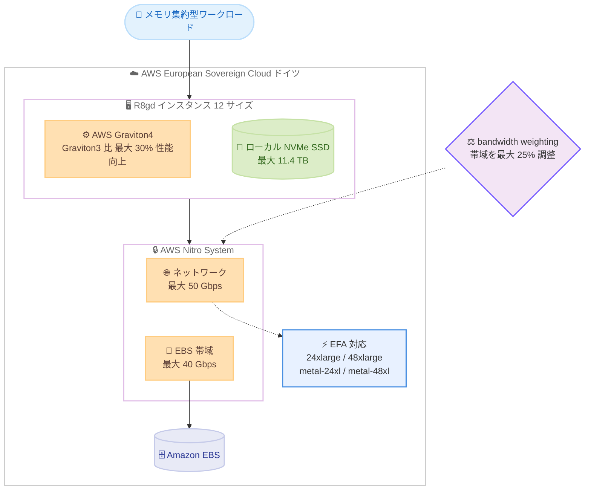

# Amazon EC2 - R8gd インスタンスの提供リージョン拡大

**リリース日**: 2026 年 10 月 9 日
**サービス**: Amazon EC2
**機能**: Amazon EC2 R8gd インスタンスの AWS European Sovereign Cloud (ドイツ) リージョンでの提供開始

📊 [このアップデートのインフォグラフィックを見る](https://takech9203.github.io/aws-news-summary/20261009-amazon-ec2-r8gd-thf.html)

## 概要

Amazon EC2 R8gd インスタンスが、AWS European Sovereign Cloud (ドイツ) リージョンで利用可能になりました。R8gd インスタンスは AWS Graviton4 プロセッサを搭載したメモリ最適化インスタンスで、最大 11.4 TB のローカル NVMe ベース SSD ブロックレベルストレージを備えています。Graviton3 ベースのインスタンスと比較して最大 30% 高い性能を実現します。

R8gd インスタンスは AWS Nitro System 上に構築されており、CPU 仮想化、ストレージ、ネットワーキング機能を専用ハードウェアとソフトウェアにオフロードすることで、高いパフォーマンスとセキュリティを提供します。高速かつ低レイテンシーなローカルストレージへのアクセスを必要とするワークロード、例えばインメモリデータベース、リアルタイムビッグデータ分析、一時データ処理などに適しています。

今回の拡大により、欧州のデータ主権要件を持つお客様も、AWS European Sovereign Cloud 内で Graviton4 ベースのローカルストレージ付きメモリ最適化インスタンスを利用できるようになりました。

**アップデート前の課題**

このアップデート以前に存在していた課題や制限は以下のとおりです。

- AWS European Sovereign Cloud (ドイツ) リージョンでは R8gd インスタンスが利用できなかった
- データ主権要件により AWS European Sovereign Cloud の利用が必須のお客様は、Graviton4 とローカル NVMe SSD を組み合わせたメモリ最適化インスタンスを選択できなかった
- 高速なローカルストレージを必要とするメモリ集約型ワークロードの移行先として、旧世代インスタンスを選択する必要があった

**アップデート後の改善**

今回のアップデートにより可能になったことは以下のとおりです。

- AWS European Sovereign Cloud (ドイツ) リージョンで R8gd インスタンスを起動できるようになった
- データ主権要件を満たしながら、Graviton3 比最大 30% の性能向上と最大 11.4 TB のローカル NVMe SSD ストレージを活用できるようになった
- EC2 instance bandwidth weighting によりネットワーク帯域と EBS 帯域を最大 25% 調整し、ワークロード特性に合わせた柔軟なリソース配分が可能になった

## アーキテクチャ図



R8gd インスタンスの主要コンポーネント構成を示しています。Graviton4 プロセッサとローカル NVMe SSD を AWS Nitro System が支え、bandwidth weighting によりネットワークと EBS の帯域配分を調整できます。

## サービスアップデートの詳細

### 主要機能

1. **AWS Graviton4 プロセッサ搭載**
   - AWS が設計した Arm ベースの最新世代プロセッサ
   - Graviton3 ベースのインスタンスと比較して最大 30% 高い性能
   - AWS Nitro System 上に構築され、高いセキュリティとパフォーマンスを両立

2. **ローカル NVMe SSD ストレージ**
   - 最大 11.4 TB のローカル NVMe ベース SSD ブロックレベルストレージ
   - 高速かつ低レイテンシーなストレージアクセスが必要なワークロードに最適
   - インスタンスに物理的に接続された一時ストレージとして利用可能

3. **柔軟な帯域設定 (EC2 instance bandwidth weighting)**
   - ネットワーク帯域と Amazon EBS 帯域を最大 25% 調整可能
   - ネットワーク重視またはストレージ重視のワークロードに合わせた柔軟なリソース配分を実現

4. **Elastic Fabric Adapter (EFA) 対応**
   - 24xlarge、48xlarge、metal-24xl、metal-48xl の各サイズで EFA をサポート
   - ノード間通信のレイテンシーを低減し、密結合型のワークロードに対応

## 技術仕様

### R8gd インスタンスの主な仕様

| 項目 | 詳細 |
|------|------|
| プロセッサ | AWS Graviton4 (Arm ベース) |
| インスタンスサイズ | 12 サイズ (medium 〜 48xlarge、metal-24xl、metal-48xl) |
| vCPU | 最大 192 vCPU (48xlarge / metal-48xl) |
| メモリ | 最大 1,536 GiB |
| ローカルストレージ | 最大 11.4 TB NVMe SSD (6 x 1900 GB) |
| ネットワーク帯域 | 最大 50 Gbps |
| EBS 帯域 | 最大 40 Gbps |
| 帯域調整 | EC2 instance bandwidth weighting で最大 25% 調整可能 |
| EFA | 24xlarge、48xlarge、metal-24xl、metal-48xl で対応 |
| 基盤 | AWS Nitro System |

### インスタンスサイズ一覧

| インスタンスサイズ | vCPU | メモリ (GiB) | ローカルストレージ (GB) | ネットワーク帯域 (Gbps) | EBS 帯域 (Gbps) |
|------|------|------|------|------|------|
| r8gd.medium | 1 | 8 | 1 x 59 NVMe SSD | 最大 12.5 | 最大 10 |
| r8gd.large | 2 | 16 | 1 x 118 NVMe SSD | 最大 12.5 | 最大 10 |
| r8gd.xlarge | 4 | 32 | 1 x 237 NVMe SSD | 最大 12.5 | 最大 10 |
| r8gd.2xlarge | 8 | 64 | 1 x 474 NVMe SSD | 最大 15 | 最大 10 |
| r8gd.4xlarge | 16 | 128 | 1 x 950 NVMe SSD | 最大 15 | 最大 10 |
| r8gd.8xlarge | 32 | 256 | 1 x 1900 NVMe SSD | 15 | 10 |
| r8gd.12xlarge | 48 | 384 | 3 x 950 NVMe SSD | 22.5 | 15 |
| r8gd.16xlarge | 64 | 512 | 2 x 1900 NVMe SSD | 30 | 20 |
| r8gd.24xlarge | 96 | 768 | 3 x 1900 NVMe SSD | 40 | 30 |
| r8gd.48xlarge | 192 | 1,536 | 6 x 1900 NVMe SSD | 50 | 40 |
| r8gd.metal-24xl | 96 | 768 | 3 x 1900 NVMe SSD | 40 | 30 |
| r8gd.metal-48xl | 192 | 1,536 | 6 x 1900 NVMe SSD | 50 | 40 |

出典: [Amazon EC2 R8g インスタンスページ](https://aws.amazon.com/ec2/instance-types/r8g/)

## 設定方法

### 前提条件

1. AWS European Sovereign Cloud (ドイツ) リージョンへのアクセス権限を持つ AWS アカウント
2. Arm アーキテクチャ (arm64) に対応した AMI
3. EC2 インスタンスを起動するための IAM 権限

### 手順

#### ステップ 1: 利用可能なインスタンスタイプの確認

```bash
aws ec2 describe-instance-type-offerings \
  --filters "Name=instance-type,Values=r8gd.*" \
  --query "InstanceTypeOfferings[].InstanceType" \
  --output table
```

対象リージョンで利用可能な R8gd インスタンスタイプの一覧を取得します。リージョンは AWS CLI のプロファイルまたは `--region` オプションで指定します。

#### ステップ 2: R8gd インスタンスの起動

```bash
aws ec2 run-instances \
  --image-id <arm64 対応 AMI の ID> \
  --instance-type r8gd.xlarge \
  --key-name <キーペア名> \
  --subnet-id <サブネット ID>
```

arm64 対応の AMI を指定して r8gd.xlarge インスタンスを起動します。Graviton ベースのインスタンスには Arm アーキテクチャ用の AMI が必要です。

#### ステップ 3: ローカル NVMe SSD ストレージの利用

```bash
# インスタンス内でローカル NVMe デバイスを確認
lsblk

# ファイルシステムを作成してマウント
sudo mkfs -t xfs /dev/nvme1n1
sudo mkdir /data
sudo mount /dev/nvme1n1 /data
```

インスタンスストアボリュームとして提供されるローカル NVMe SSD にファイルシステムを作成し、マウントします。インスタンスストアは一時ストレージであり、インスタンスの停止や終了によりデータが失われる点に注意してください。

## メリット

### ビジネス面

- **データ主権要件への対応**: AWS European Sovereign Cloud 内で最新世代のインスタンスを利用でき、欧州の規制要件を満たしながらモダナイゼーションを推進できる
- **価格性能比の向上**: Graviton3 比最大 30% の性能向上により、同等ワークロードの実行コスト削減が期待できる
- **移行支援プログラム**: AWS Graviton Fast Start プログラムを活用して、Graviton への移行を迅速に開始できる

### 技術面

- **高速ローカルストレージ**: 最大 11.4 TB の NVMe SSD により、低レイテンシーなストレージアクセスを必要とするワークロードに対応できる
- **柔軟な帯域配分**: EC2 instance bandwidth weighting により、ネットワークと EBS の帯域をワークロード特性に合わせて最大 25% 調整できる
- **低レイテンシー通信**: 大規模サイズでは EFA に対応し、ノード間通信が重要な分散ワークロードにも適用できる

## デメリット・制約事項

### 制限事項

- Arm アーキテクチャ (arm64) 対応の AMI とソフトウェアが必要であり、x86 専用のワークロードはそのままでは移行できない
- ローカル NVMe SSD はインスタンスストアであり、インスタンスの停止・終了時にデータが失われる
- EFA は 24xlarge、48xlarge、metal-24xl、metal-48xl のサイズに限定される

### 考慮すべき点

- 永続化が必要なデータは Amazon EBS や Amazon S3 と組み合わせて保護する設計が必要
- 商用ソフトウェアやサードパーティ製エージェントの arm64 対応状況を事前に確認する必要がある
- AWS European Sovereign Cloud は独立したクラウド環境であり、既存の商用リージョンとは別のアカウント体系・運用モデルとなる点を考慮する

## ユースケース

### ユースケース 1: インメモリデータベースのホスティング

**シナリオ**: 欧州のデータ主権要件を持つ企業が、Redis や Memcached などのインメモリデータベースを AWS European Sovereign Cloud 上で運用する。

**実装例**:
```
- r8gd.16xlarge (64 vCPU、512 GiB メモリ) を選択
- ローカル NVMe SSD をスナップショットや AOF の書き込み先として利用
- bandwidth weighting でネットワーク帯域を優先する構成に調整
```

**効果**: 大容量メモリと低レイテンシーなローカルストレージにより、高スループットなキャッシュ・データベース処理をデータ主権要件を満たしながら実現できます。

### ユースケース 2: リアルタイムビッグデータ分析

**シナリオ**: ログやイベントストリームをリアルタイムに処理する分析基盤で、シャッフルデータや中間データの高速な読み書きが必要となる。

**実装例**:
```
- r8gd.24xlarge で Spark などの分散処理クラスターを構成
- 中間データをローカル NVMe SSD に配置して I/O ボトルネックを解消
- EFA を有効化してノード間通信のレイテンシーを低減
```

**効果**: メモリとローカルストレージの両方を活用することで、大規模データ処理のジョブ実行時間を短縮できます。

### ユースケース 3: 一時データ処理を伴うメモリ集約型アプリケーション

**シナリオ**: 動画のトランスコードや科学技術計算など、大量の一時ファイルを生成するメモリ集約型アプリケーションを運用する。

**実装例**:
```
- r8gd.8xlarge (32 vCPU、256 GiB メモリ) を選択
- 一時ファイルの出力先をローカル NVMe SSD に設定
- 最終成果物のみ Amazon EBS または Amazon S3 に保存
```

**効果**: EBS への I/O を削減しつつ高速な一時領域を確保でき、処理性能の向上とコストの最適化を両立できます。

## 料金

R8gd インスタンスは、オンデマンド、Savings Plans、リザーブドインスタンス、スポットインスタンスの各購入オプションで利用できます。料金はリージョンとインスタンスサイズにより異なるため、最新の料金は料金ページで確認してください。

- [Amazon EC2 オンデマンド料金](https://aws.amazon.com/ec2/pricing/on-demand/)
- [Amazon EC2 スポットインスタンス料金](https://aws.amazon.com/ec2/spot/pricing/)

## 利用可能リージョン

今回のアップデートにより、AWS European Sovereign Cloud (ドイツ) リージョンで R8gd インスタンスが利用可能になりました。その他の利用可能リージョンについては、[Amazon EC2 R8g インスタンスページ](https://aws.amazon.com/ec2/instance-types/r8g/) を参照してください。

## 関連サービス・機能

- **AWS Graviton4**: R8gd に搭載される AWS 設計の Arm ベースプロセッサ。価格性能比の向上に寄与する
- **AWS Nitro System**: 仮想化機能を専用ハードウェアにオフロードする基盤。高いパフォーマンスとセキュリティを提供する
- **Amazon EBS**: 永続ストレージとして最大 40 Gbps の専用帯域で接続可能
- **Elastic Fabric Adapter (EFA)**: 大規模サイズで利用可能な低レイテンシーネットワークインターフェイス
- **AWS Graviton Fast Start**: Graviton への移行を支援するプログラム

## 参考リンク

- 📊 [インフォグラフィック](https://takech9203.github.io/aws-news-summary/20261009-amazon-ec2-r8gd-thf.html)
- [公式発表 (What's New)](https://aws.amazon.com/about-aws/whats-new/2026/10/amazon-ec2-r8gd-thf/)
- [Amazon EC2 R8g インスタンス](https://aws.amazon.com/ec2/instance-types/r8g/)
- [AWS Graviton Fast Start プログラム](https://aws.amazon.com/ec2/graviton/fast-start/)
- [Amazon EC2 料金ページ](https://aws.amazon.com/ec2/pricing/on-demand/)

## まとめ

AWS European Sovereign Cloud (ドイツ) リージョンで R8gd インスタンスが利用可能になり、データ主権要件を持つお客様も Graviton4 の高い価格性能比と最大 11.4 TB のローカル NVMe SSD ストレージを活用できるようになりました。インメモリデータベースやリアルタイム分析など、高速なローカルストレージを必要とするメモリ集約型ワークロードを運用している場合は、R8gd への移行を検討することを推奨します。
