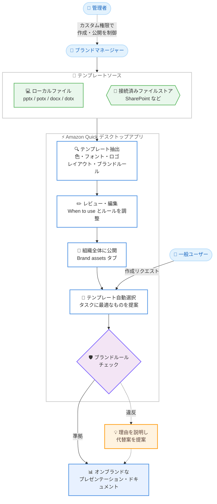

# Amazon Quick - ブランドテンプレート対応によるオンブランドなプレゼンテーション・ドキュメント作成

**リリース日**: 2026 年 10 月 9 日
**サービス**: Amazon Quick
**機能**: ブランドテンプレート (Brand assets)

📊 [このアップデートのインフォグラフィックを見る](https://takech9203.github.io/aws-news-summary/20261009-amazon-quick-brand-templates-on-brand-presentations-documents.html)

## 概要

Amazon Quick がブランドテンプレートのアップロードに対応しました。組織の承認済みビジュアルアイデンティティに一致したプレゼンテーションやドキュメントを、Quick で生成できるようになります。ブランドマネージャーが PowerPoint や Word のテンプレートをアップロード (SharePoint などの接続済みファイルストアからの取得も可能) すると、Quick がファイルから色、フォント、ロゴ、レイアウト、ブランドルールを抽出します。

ブランドマネージャーは抽出結果をレビュー・編集したうえで、組織全体に公開します。公開後、Quick は新規アセットの作成時にテンプレートのルールに従い、ルールに違反するリクエストに対しては理由を説明したうえでオンブランドの代替案を提案します。また、タスクごとに最適なテンプレートを自動選択するため、ユーザーはチャットのたびにテンプレートファイルを探して添付する必要がありません (ユーザーによる変更も可能です)。

本機能は Amazon Quick デスクトップアプリで一般提供が開始されており、Amazon Quick Enterprise エディションで利用できます。ブランドやマーケティングチームなど、承認されたメンバーのみがテンプレートを定義できるよう、カスタム権限で作成・公開権限を管理できます。

**アップデート前の課題**

- 以前は、Quick で生成したプレゼンテーションやドキュメントを組織のブランドガイドラインに準拠させるために、ユーザーが毎回チャットセッションでテンプレートファイルを探して添付する必要があった
- 以前は、色、フォント、ロゴ、レイアウトなどのブランド要素を生成物に反映する一元的な仕組みがなく、組織全体でビジュアルアイデンティティの一貫性を保つことが難しかった
- 以前は、「タイトルスライドに何を載せないか」「どのレイアウトをどの用途に使うか」といったブランドルールの遵守が、個々のユーザーの知識と注意力に依存していた

**アップデート後の改善**

- 今回のアップデートにより、ブランドマネージャーがテンプレートを一度セットアップするだけで、組織全体のユーザーがオンブランドな生成物を得られるようになった
- 今回のアップデートにより、Quick がテンプレートの「When to use」ガイダンスに基づいてタスクに最適なテンプレートを自動選択するため、ユーザーがテンプレートを探す手間が不要になった
- 今回のアップデートにより、ブランドルールに違反するリクエストに対して Quick が理由を説明し、オンブランドな代替案を提案するガードレールが実現した
- 今回のアップデートにより、カスタム権限 (Create and update brand kits) でテンプレートの作成・公開を承認済みメンバーに限定できるようになった

## アーキテクチャ図



ブランドマネージャーがテンプレートをアップロードすると、Quick が抽出・レビュー・公開のフローを経て組織全体に展開し、一般ユーザーの作成リクエストに対してテンプレートの自動選択とブランドルールのチェックを行います。

## サービスアップデートの詳細

### 主要機能

1. **テンプレートの抽出**
   - PowerPoint (`.pptx`, `.potx`) および Word (`.docx`, `.dotx`) ファイルからテンプレートを抽出 (最大 50 MB)
   - ローカルファイルのアップロードに加え、SharePoint などの接続済みファイルストアからのファイル取得にも対応 (コネクタ経由の取得は一回限りのプルで、継続的な同期ではない)
   - 色 (hex 値付きのパレット)、テキストスタイル (フォントファミリー、サイズ、ウェイト、色)、ロゴ、ドキュメント構造、ページ寸法を抽出
   - 抽出はガイド付きの会話形式で進行し、スライド数やアセット数、検出したギャップをレポート

2. **ブランドルールと「When to use」ガイダンス**
   - テンプレート内の説明スライド、スピーカーノート、レイアウトガイダンスなどのコンテキストから、使用ルールを箇条書きとして自動生成
   - 「When to use」フィールドにテンプレートの用途を自動推定して記載し、タスクとのマッチングに使用
   - ブランドマネージャーはルールと用途をインラインで編集可能 (誤読の修正、不要なルールの削除、暗黙のルールの追加)

3. **レビューと組織全体への公開**
   - 公開前はドラフトとして作成者のみに表示され、自身でテスト生成が可能
   - 公開すると Brand assets タブに組織全体で表示され、Quick がタスクに応じてテンプレートを提案
   - 「ブランド」は複数の「テンプレート」(ピッチデッキ、提案書、ワンページャーなど) を束ねる公開単位

4. **テンプレートの自動選択とガードレール**
   - ユーザーの作成リクエストを各テンプレートの「When to use」ガイダンスと照合し、最適なテンプレートを Suggested タブに事前選択
   - 組織の承認済みテンプレートは組み込みのスタイルプリセットより優先してランク付け
   - リクエストがブランドルールに違反する場合、Quick が理由を説明してオンブランドな代替案を提案
   - ユーザーは Brands、Presets、Customize から別のスタイルを選択することも可能

5. **カスタム権限による管理**
   - 「Create and update brand kits」権限でブランドアセットの作成・更新・公開・削除を制御
   - デフォルトでは全ユーザーに付与されており、管理者が無効化することで承認済みチームに限定可能
   - 権限のないユーザーも、公開済みブランドの閲覧・ダウンロード・適用は可能

## 技術仕様

### サポートされるソースファイル

| ファイルタイプ | 拡張子 | 生成されるテンプレート |
|------|------|------|
| PowerPoint プレゼンテーション | `.pptx` | プレゼンテーションテンプレート |
| PowerPoint テンプレート | `.potx` | プレゼンテーションテンプレート |
| Word ドキュメント | `.docx` | ドキュメントテンプレート |
| Word テンプレート | `.dotx` | ドキュメントテンプレート |

ファイルサイズの上限は 50 MB です。その他のファイルタイプをアップロードすると、受け付け可能なタイプの一覧を含むエラーが表示されます。

### 抽出される要素

| 抽出対象 | 説明 |
|------|------|
| 色 | 各色の hex 値を含むパレット |
| テキストスタイル | フォントファミリー、ポイントサイズ、ウェイト、色を含む名前付きスタイル |
| ロゴ | ファイル内で検出されたロゴ画像アセット |
| 構造とアウトライン | ドキュメントの場合: セクション構造、見出し階層、スタイルグループ |
| ページ寸法 | ドキュメントの場合: ページサイズ、余白、向き、段組み数 |
| When to use | テンプレートの用途。タスクとのマッチングに使用。自動生成され、編集可能 |
| ルール | 生成時に使用される使用ルール。自動生成され、編集可能 |

### 権限

| 権限 | 制御対象 | 付与時 | 拒否時 |
|------|------|------|------|
| Create and update brand kits | ブランドアセットのキュレーション | ブランドの抽出、編集、公開、更新、削除が可能 | 公開済みブランドの閲覧・ダウンロード・適用のみ可能 |

## 設定方法

### 前提条件

1. Amazon Quick Enterprise エディションを利用していること (ブランドアセットは Enterprise エディション限定)
2. ユーザーが組織の認証情報で Quick にサインインしていること
3. ユーザーが Quick で Word ドキュメントおよび PowerPoint プレゼンテーションを作成できる権限を持っていること
4. ファイルストアから直接テンプレートを抽出する場合、ブランドマネージャーが対象サービスへのアクセス権を持ち、アカウントでコネクタを有効化していること

### 手順

#### ステップ 1: テンプレートの抽出

1. Amazon Quick デスクトップアプリで Brand assets タブを開き、[Create] から [Upload template] を選択します。
2. ファイルを選択すると、Quick がセッションを開いてファイルを添付します。
3. チャットで、既存のブランドにテンプレートを追加するか、新しいブランドを作成するかを指定します。

接続済みファイルストアから取得する場合は、[Create using a connector] を選択し、ファイルのリンクを貼り付けるか、名前と場所で指定します (例: 「Brand Assets ライブラリにあるコーポレートデッキのテンプレート」)。Quick はブランドマネージャー自身のアクセス権を使用してファイルを取得します。

#### ステップ 2: 抽出結果のレビューと編集

チャットの横に開くパネルで、Quick が検出した内容を確認・編集します。

- **When to use**: テンプレートの用途。「社外向け提案書と作業範囲記述書」のように、同僚がタスクを表現する際の言葉で具体的に記述します
- **ルール**: 生成時に使用される箇条書きのガイダンス。誤って抽出された項目を削除し、ソースファイルで暗黙的だったルールを追加します
- **ロゴ**: 偶発的に検出された画像を削除し、ダークバックグラウンド用のバリアントなど不足しているロゴを追加します

#### ステップ 3: ブランドの公開

抽出フォームで [Publish] を選択して組織全体に公開するか、[Save as draft] でドラフトとして保存します。チャットから公開を指示することも可能です。公開後、ブランドは全ユーザーの Brand assets タブに表示され、Quick がドキュメントやプレゼンテーションの計画時にテンプレートを提案し始めます。

**注意**: 公開は編集したテンプレートだけでなく、手元のブランドのコピー全体で公開済みブランドを置き換えます。他のブランドマネージャーが追加したテンプレートを誤って削除しないよう、編集前にチャットで最新の公開済みコピーを取得してください。

## メリット

### ビジネス面

- **ブランド一貫性の確保**: 組織全体で承認済みのビジュアルアイデンティティに準拠した資料を作成でき、ブランドガバナンスを強化できる
- **資料作成の効率化**: ユーザーがテンプレートを探して添付する手間がなくなり、資料作成のリードタイムを短縮できる
- **ガバナンスの一元化**: ブランドやマーケティングチームなど承認されたメンバーのみがビジュアル標準を定義でき、統制された運用が可能

### 技術面

- **自動抽出による省力化**: PowerPoint / Word ファイルから色、フォント、ロゴ、レイアウト、ルールを自動抽出するため、手動でのスタイル定義が不要
- **インテリジェントなマッチング**: 「When to use」ガイダンスに基づき、タスクごとに最適なテンプレートを自動選択
- **コネクタ連携**: SharePoint などの接続済みファイルストアに保管された承認済みテンプレートを直接取得可能
- **説明可能なガードレール**: ルール違反時に理由を説明して代替案を提案するため、ユーザーがブランドルールを学習しながら利用できる

## デメリット・制約事項

### 制限事項

- Amazon Quick Enterprise エディション限定の機能であり、デスクトップアプリでのみ利用可能
- サポートされるソースファイルは PowerPoint (`.pptx`, `.potx`) と Word (`.docx`, `.dotx`) のみで、最大 50 MB
- ブランドのバージョニング機能は提供されていない
- コネクタ経由のテンプレート取得は一回限りのプルであり、ソースファイルの変更は自動同期されない (再取得・再抽出・再公開が必要)
- 公開はブランドのコピー全体を置き換えるため、古いコピーから公開すると他のブランドマネージャーの変更が失われる可能性があり、削除されたテンプレートは復元できない

### 考慮すべき点

- 複数のテンプレートで「When to use」の記述が類似していると、Quick が意図しないテンプレートを選択する場合がある。用途の境界が明確になるよう記述を調整する必要がある
- 抽出品質はソースファイルの品質に依存する。実際のレイアウト、名前付きスタイル、ブランドカラーを備えたファイルの方が良好に抽出される
- 「Create and update brand kits」権限はデフォルトで全ユーザーに付与されるため、ブランド統制を厳格にする場合は管理者による権限の制限設定が必要
- 生成された出力がブランドガイドラインに準拠しているか、共有前にレビューすることが推奨される

## ユースケース

### ユースケース 1: 全社共通のコーポレートブランド展開

**シナリオ**: 大企業のブランドチームが、全社員の作成するプレゼンテーションをコーポレートブランドガイドラインに準拠させたい。

**実装例**:
```text
1. 管理者がカスタム権限で「Create and update brand kits」を
   ブランドチームのみに制限
2. ブランドマネージャーがコーポレートデッキの .potx を
   アップロードし、抽出結果をレビュー
3. 「When to use」に「社内外向けの標準プレゼンテーション」と
   記述し、ルールを整備して公開
```

**効果**: 全社員が特別な操作なしにオンブランドなプレゼンテーションを生成でき、ブランド逸脱のリスクを低減できる。

### ユースケース 2: 用途別テンプレートの自動使い分け

**シナリオ**: 営業組織で、ピッチデッキ、提案書、ワンページャーなど用途ごとに異なるテンプレートを使い分けたい。

**実装例**:
```text
1. 1 つのブランド配下にピッチデッキ、提案書、
   ワンページャーの 3 テンプレートを登録
2. それぞれの「When to use」に用途を明確に記述
   - ピッチデッキ: 「新規顧客向けの初回提案プレゼン」
   - 提案書: 「クライアント向け提案書と作業範囲記述書」
   - ワンページャー: 「製品概要の 1 枚サマリー」
3. ユーザーは作成リクエストを出すだけで、Quick が
   タスクに合うテンプレートを Suggested タブに事前選択
```

**効果**: ユーザーがテンプレートの選定に迷うことなく、タスクに適したデザインで資料を作成できる。

### ユースケース 3: SharePoint の承認済みテンプレート活用

**シナリオ**: 承認済みテンプレートを SharePoint のブランドアセットライブラリで管理している組織が、Quick にテンプレートを取り込みたい。

**実装例**:
```text
1. ブランドマネージャーが SharePoint コネクタを有効化
2. Brand assets タブで [Create using a connector] を選択
3. ファイルのリンクを貼り付けるか、
   「Brand Assets ライブラリにあるコーポレートデッキの
   テンプレート」のように名前と場所で指定
4. 以降は通常のアップロードと同じ抽出・レビュー・公開フロー
```

**効果**: 既存のテンプレート管理フローを維持したまま、Quick のブランドアセットとして展開できる。ソースファイル更新時は再取得・再公開で反映する。

## 料金

ブランドアセット機能は Amazon Quick Enterprise エディションで利用できます。本機能自体の追加料金に関する記載は公式発表にはありません。Amazon Quick Suite の料金体系の詳細は料金ページを参照してください。

## 利用可能リージョン

本機能は Amazon Quick デスクトップアプリで一般提供されています。公式発表に特定のリージョンに関する記載はありません。

## 関連サービス・機能

- **Amazon Quick Suite**: 本機能を提供するエージェント型の生産性スイート。ドキュメントやプレゼンテーションの生成機能の一部としてブランドアセットが動作する
- **Quick コネクタ**: SharePoint などの外部ファイルストアからテンプレートを取得するための連携機能
- **カスタム権限 (Custom permissions)**: 「Create and update brand kits」機能の付与・制限を管理する権限管理の仕組み

## 参考リンク

- 📊 [インフォグラフィック](https://takech9203.github.io/aws-news-summary/20261009-amazon-quick-brand-templates-on-brand-presentations-documents.html)
- [公式発表 (What's New)](https://aws.amazon.com/about-aws/whats-new/2026/10/amazon-quick-brand-templates-on-brand-presentations-documents/)
- [ドキュメント (Brand assets - Amazon Quick User Guide)](https://docs.aws.amazon.com/quick/latest/userguide/brand-assets-desktop.html)
- [Amazon Quick Suite](https://aws.amazon.com/quicksuite/)

## まとめ

Amazon Quick のブランドテンプレート対応により、ブランドマネージャーが一度テンプレートをセットアップするだけで、組織全体のユーザーが承認済みビジュアルアイデンティティに準拠した資料を生成できるようになりました。テンプレートの自動選択とルール違反時の代替案提案により、ブランドガバナンスと作成効率を両立できます。Amazon Quick Enterprise エディションを利用している組織は、カスタム権限の設定とあわせてブランドアセットの導入を検討することを推奨します。
