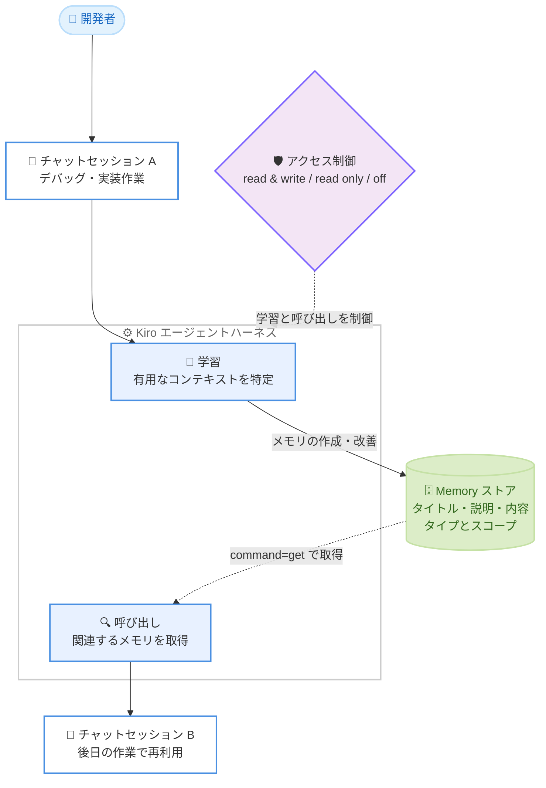

# Kiro - チャットセッションをまたぐ Memory 機能 (CLI 2.29.0)

**リリース日**: 2026 年 10 月 9 日
**サービス**: Kiro
**機能**: CLI 2.29.0 - Memory Across Chat Sessions

📊 [このアップデートのインフォグラフィックを見る](https://takech9203.github.io/aws-news-summary/20261009-kiro-changelog-2026-10-09.html)

## 概要

AWS の AI 搭載 IDE である Kiro の CLI 2.29.0 がリリースされ、ローカル V3 セッション向けの Memory 機能が導入されました。Kiro が作業の中からリポジトリのコマンドや規約といった有用なコンテキストを学習し、後のチャットセッションで呼び出せるようになります。これまでセッションごとに説明し直していた情報を、Kiro 自身が記憶して再利用します。

Memory は、コンテキストを組み立ててエージェントを実行するシステムである Kiro エージェントハーネスの一部です。「作業の中から保持する価値のある情報を判断する」「目の前のタスクに関連する記憶を見つける」という 2 つの課題を解決します。各メモリはタイトル、説明、内容を持つレコードであり、過去の会話のコピーではありません。たとえば、デバッグ中に「このリポジトリの統合テストはローカルデータベースをシードするまで失敗する」と Kiro が学習すると、後のセッションでは原因を再調査する代わりに、先にデータベースをシードできます。

Memory へのアクセスは `/memories` コマンドで制御でき、`read & write`、`read only`、`off` の 3 段階から選択できます。また、`Automatic memory updates` によりセッション終了後も含めてメモリの作成・改善を Kiro に任せるかどうかを選べます。信頼していないワークスペースでは、メモリの読み取りは可能ですが、追加・変更・削除はできません。

**アップデート前の課題**

- チャットセッションを終了すると、そのセッションで得た知見 (リポジトリのコマンド、規約、デバッグの洞察など) が失われていた
- 新しいセッションを開始するたびに、同じコンテキストをユーザーが説明し直す必要があった
- 過去のセッションで判明した問題の原因を、後のセッションで再調査することがあった

**アップデート後の改善**

- Kiro が作業から有用なコンテキストを学習し、後のセッションで必要になったときに呼び出せるようになった
- `/memories` の `config` でアクセスレベル (`read & write` / `read only` / `off`) と自動更新を制御できるようになった
- `/memories` の `list` で保存されたメモリの検索・プレビュー・閲覧ができるようになった
- 信頼していないワークスペースではメモリの変更が制限され、安全に利用できるようになった

## アーキテクチャ図



エージェントハーネスがセッション A の作業から有用なコンテキストを学習して Memory ストアに保存し、後のセッション B で関連するメモリを呼び出して再利用する流れを示しています。学習と呼び出しはアクセス制御の設定に従います。

## サービスアップデートの詳細

### 主要機能

1. **チャットセッションをまたぐ Memory**
   - ローカル V3 セッションで、Kiro が作業から有用なコンテキスト (リポジトリのコマンド、規約、修正内容、デバッグの洞察、すでに除外したアプローチ、作業の好みなど) を学習し、後のセッションで呼び出せる
   - 各メモリはタイトル、説明、内容を持つレコードで、過去の会話のコピーではない
   - 各メモリには保持する情報の種類を示す `type` と、適用範囲を示す `scope` がある。リポジトリに紐づくメモリは `repo:github/<owner>/<repository>` のようなスコープを持つ
   - Kiro がメモリを使用すると、作業中のチャットに `command=get` とメモリのタイトルを含む **Memory** エントリが表示される

2. **アクセス制御と自動更新**
   - `/memories` で `config` を選択し、`read & write`、`read only`、`off` から選択する
   - `read & write`: Kiro がメモリを使用し、権限に従って変更できる唯一のレベル
   - `read only`: 既存のメモリを使用するが、変更や自動更新は行わない
   - `off`: メモリの使用も変更も行わない
   - アクセスレベルの変更は次のセッションから適用される
   - `read & write` では `Automatic memory updates` により、セッション終了後も含めてメモリの作成・改善を Kiro に任せられる。この設定の変更は即時に適用される

3. **メモリの一覧・プレビュー**
   - `/memories` で `list` を選択すると、保存されたメモリを検索・プレビュー・閲覧できる
   - 各行にはタイトル、1 行の説明、最終更新からの経過時間が表示される
   - `ctrl+p` またはクリックでプレビュー (タイプ、スコープ、更新時刻、説明) を表示し、`Enter` またはダブルクリックで全文 (内容、ID、タイムスタンプ) を開く
   - 一覧は読み取り専用。メモリの修正や削除は、チャットで Kiro に依頼する

4. **ワークスペース信頼との連携**
   - 信頼していないワークスペースでは、`read & write` であってもメモリの追加・変更・削除はできない (読み取りは可能)

### その他の改善 (CLI 2.29.0)

- **プロファイル単位のデバイスフロー制御**: 管理者が Kiro プロファイルごとにデバイスフローサインインを無効化できる。該当プロファイルはデバイスフローのログインとプロファイル切り替え時に非表示になり、ブラウザサインインは引き続き利用可能
- **ディレクトリ単位のエージェントアップグレード**: `kiro-cli agent upgrade <dir>` でトップレベルのエージェント JSON ファイルを V2 と V3 の両方で読み込める形式にアップグレードできる。`--dry-run` で書き込みなしのプレビュー、`--no-backup` でバックアップのスキップが可能
- **V2 TUI の Hook グループ**: `read` などの Hook マッチャーがグループ内のすべてのツールをカバーし、ブロッキングの `preToolUse` Hook でグループ内の任意のツールを停止できる
- **V2 TUI の Hook 入力**: ツール Hook が `tool_tags` を受け取り、スクリプトからツールのグループを確認できる
- **V3 ACP サインイン**: `kiro-cli acp` がデフォルトで Kiro CLI のログインを使用。接続クライアント側でサインインする場合は `--auth-method=client` を指定
- **V3 MCP サーバー**: カスタムエージェントはツール設定で許可された `mcp.json` サーバーのみを起動し、`stdio` MCP サーバーはエージェントの環境変数を完全に継承する

### 主な修正

- Classic の `fs_write` が、シンボリックリンクにより `allowedPaths` 外へリダイレクトされる書き込みを自動承認しないよう修正
- Classic と V2 のモデルフォールバック変更が、再起動なしで現在のセッションに反映されるよう修正
- V2 と V3 で MCP OAuth の認可 URL が表示され、SSH や tmux セッションからも開けるよう修正
- V3 の非対話実行が `telemetry.enabled` と `KIRO_DISABLE_TELEMETRY` を尊重するよう修正
- V3 の `/upgrade-agent` が `fs_read` などのレガシー Hook マッチャーを動作する形式に書き換え、マッチ範囲が広がる場合は警告するよう修正
- Classic と V2 のナレッジ検索が全ベース横断の統合結果を返すよう修正
- 高負荷時に V3 セッションが閉じることがある問題、サブエージェントとして起動したカスタムエージェントが自身の `mcpServers` を読み込まない問題などを修正
- `us-east-1` 以外で発行された `KIRO_API_KEY` がホームリージョンで認証されるよう修正

## 技術仕様

### Memory のアクセスレベル

| アクセスレベル | 動作 |
|------|------|
| `read & write` | Kiro がメモリを使用し、権限に従って変更できる。自動更新を利用可能 |
| `read only` | 既存のメモリを使用する。変更や自動更新は行わない |
| `off` | メモリの使用も変更も行わない |

### Memory の構成要素と動作

| 項目 | 詳細 |
|------|------|
| 対象セッション | Kiro CLI のローカル V3 セッション |
| メモリの構造 | タイトル、説明、内容を持つレコード (会話のコピーではない) |
| メタデータ | `type` (情報の種類) と `scope` (適用範囲、例: `repo:github/<owner>/<repository>`) |
| 使用時の表示 | チャットに `command=get` とメモリのタイトルを含む Memory エントリを表示 |
| アクセス変更の反映 | 次のセッションから適用 |
| 自動更新の反映 | 即時に適用 (セッション終了後の作成・改善も含む) |
| 未信頼ワークスペース | 読み取りのみ可能。追加・変更・削除は不可 |
| 一覧の操作 | 読み取り専用。修正・削除はチャットで Kiro に依頼 |

### Memory と他のコンテキストの関係

| コンテキスト | 役割 |
|------|------|
| Memory | Kiro が作業から学習し、後のセッションで呼び出せるコンテキスト |
| Steering | Kiro が従うべき内容を明示的に制御したいときにユーザーが書くルールとガイダンス |
| セッション履歴 | 同じセッションを継続・再開するときの会話と進行中の作業 |
| Compaction | 長いセッションをコンテキスト上限内に収めるための古い会話履歴の要約 |
| ナレッジベース (CLI) | ユーザーが選択してインデックス化し、Kiro が必要時に検索する参照資料 |

Memory は学習したコンテキストを追加するものであり、現在の会話、Steering、参照資料を置き換えるものではありません。一貫して適用すべきルールは Steering に記述します。

## 設定方法

### 前提条件

1. Kiro CLI 2.29.0 以降にアップデートしていること
2. ローカル V3 セッションを使用していること
3. メモリの追加・変更・削除を行う場合、ワークスペースを信頼していること

### 手順

#### ステップ 1: Memory のアクセスレベルを設定する

```
/memories
```

ローカル V3 セッションで `/memories` と入力し、`config` を選択して `read & write`、`read only`、`off` からアクセスレベルを選択します。アクセスレベルの変更は次のセッションから適用されます。

#### ステップ 2: 自動更新を設定する

`read & write` を選択した場合、`Automatic memory updates` を選択または解除します。有効にすると、セッション終了後も含めて Kiro がメモリを自動的に作成・改善します。この設定の変更は即時に適用されます。

#### ステップ 3: 保存されたメモリを確認する

```
/memories
```

`list` を選択すると、保存されたメモリの一覧が表示されます。文字を入力して絞り込み、`ctrl+p` でプレビュー、`Enter` で全文を開きます。一覧は読み取り専用のため、メモリの修正や削除はチャットで Kiro に依頼します。

#### ステップ 4: セッション中の Memory 使用を確認する

Kiro がメモリを使用すると、作業中のチャットに `command=get` とメモリのタイトルを含む Memory エントリが表示されます。これにより、どの記憶が作業に使われたかを把握できます。

## メリット

### ビジネス面

- **生産性の向上**: セッションごとにコンテキストを説明し直す時間が削減され、タスクの継続に集中できる
- **知見の蓄積**: デバッグの洞察やすでに除外したアプローチが記憶され、同じ調査の繰り返しを避けられる
- **統制された導入**: アクセスレベルと自動更新の制御により、チームのポリシーに応じて利用範囲を調整できる

### 技術面

- **構造化された記憶**: メモリは会話のコピーではなく、タイトル・説明・内容を持つレコードとして管理され、タイプとスコープで整理される
- **透明性**: メモリ使用時にチャットに Memory エントリが表示されるため、エージェントの判断材料を確認できる
- **安全性**: 信頼していないワークスペースではメモリの変更が制限され、悪意あるリポジトリによる記憶の改ざんを防げる

## デメリット・制約事項

### 制限事項

- Memory は Kiro CLI のローカル V3 セッションでのみ利用可能 (Classic および V2 セッションでは利用不可)
- アクセスレベルの変更は次のセッションから適用される (即時反映されない)
- `/memories` の `list` は読み取り専用で、一覧から直接メモリを修正・削除できない
- 信頼していないワークスペースでは、`read & write` でもメモリの追加・変更・削除ができない

### 考慮すべき点

- 一貫して適用すべきルールは Memory ではなく Steering に記述する必要がある。Memory は学習したコンテキストを追加するものであり、明示的なルールの代替ではない
- `Automatic memory updates` を有効にすると、セッション終了後も Kiro がメモリを作成・改善するため、記憶される内容を定期的に `list` で確認することが望ましい
- 意図しない学習を避けたい場合は、`read only` または `off` を選択する運用も検討する

## ユースケース

### ユースケース 1: デバッグの洞察を次のセッションで再利用

**シナリオ**: 統合テストがローカルデータベースをシードするまで失敗することをデバッグ中に突き止めた。次回以降のセッションで同じ調査を繰り返したくない。

**実装例**:
```
1. /memories の config で read & write と Automatic memory updates を有効化
2. デバッグ作業を実施 (Kiro が洞察をメモリとして記録)
3. 後日のセッションでテスト実行を依頼すると、Kiro が
   command=get, title=seed-db-before-integration-tests のようなメモリを取得し、
   先にデータベースをシードしてからテストを実行
```

**効果**: 後のセッションで原因を再調査する代わりに、記憶された手順に従って先にデータベースをシードでき、調査時間を削減できる。

### ユースケース 2: リポジトリのコマンドと規約の記憶

**シナリオ**: リポジトリ固有のビルドコマンド、テストコマンド、コーディング規約を、セッションのたびに説明し直している。

**実装例**:
```
1. read & write を有効にして通常の開発作業を行う
2. Kiro がリポジトリのコマンドや規約を scope 付きのメモリとして学習
   (例: repo:github/<owner>/<repository>)
3. 新しいセッションでは説明なしで規約に沿った作業を依頼
```

**効果**: リポジトリに紐づくスコープでメモリが管理され、セッションをまたいでコマンドや規約の説明が不要になる。

### ユースケース 3: 読み取り専用運用での安全な利用

**シナリオ**: チームで検証済みのメモリだけを使い、新しい記憶の自動追加は避けたい。

**実装例**:
```
1. 検証フェーズでは read & write でメモリを蓄積し、list で内容を確認
2. 不要・不正確なメモリはチャットで Kiro に依頼して修正・削除
3. 運用フェーズでは config を read only に変更し、既存メモリのみを使用
```

**効果**: `read only` では既存のメモリを使用しつつ変更や自動更新が行われないため、検証済みのコンテキストだけで安定した動作を維持できる。

## 利用可能リージョン

Kiro はグローバルに利用可能なサービスです。Memory 機能は Kiro CLI 2.29.0 以降のローカル V3 セッションで利用できます。

## 関連サービス・機能

- **Kiro Steering**: ユーザーが明示的に記述するルールとガイダンス。Memory が学習ベースであるのに対し、一貫して適用すべきルールは Steering に記述する
- **Kiro Compaction**: 長いセッションの古い会話履歴を要約してコンテキスト上限内に収める機能。Memory とともにエージェントハーネスのコンテキスト管理を構成する
- **Kiro ナレッジベース (CLI)**: ユーザーが選択・インデックス化した参照資料を Kiro が検索する機能。Memory の学習コンテキストを補完する
- **Kiro ワークスペース信頼**: 未信頼ワークスペースでのメモリ変更を制限する安全機構

## 参考リンク

- 📊 [インフォグラフィック](https://takech9203.github.io/aws-news-summary/20261009-kiro-changelog-2026-10-09.html)
- [Kiro Changelog](https://kiro.dev/changelog/)
- [Kiro Changelog - CLI 2.29.0](https://kiro.dev/changelog/cli/2-29)
- [Kiro ドキュメント - Memory](https://kiro.dev/docs/memory/)

## まとめ

Kiro CLI 2.29.0 の Memory は、チャットセッションをまたいでコンテキストを引き継ぐという、エージェント型開発ツールの実用性を大きく高める機能です。アクセスレベルと自動更新の制御、未信頼ワークスペースでの変更制限により、安全性と統制を保ちながら導入できます。ローカル V3 セッションで `/memories` の `config` から `read & write` を有効化し、リポジトリのコマンドや規約を Kiro に学習させることから始めることを推奨します。
