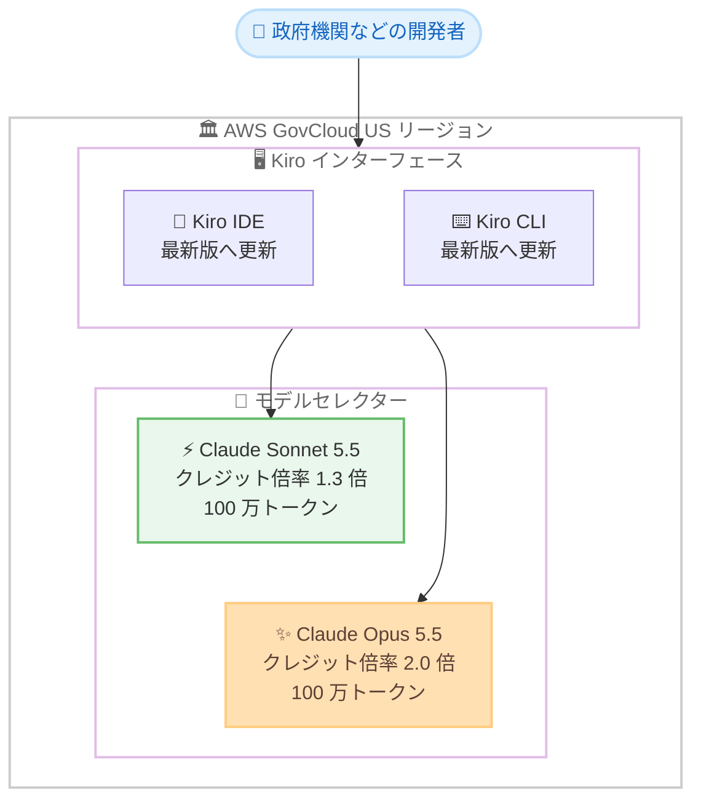

# Kiro - Claude Sonnet 5.5 と Claude Opus 5.5 が AWS GovCloud (US) で利用可能に

**リリース日**: 2026 年 10 月 9 日
**サービス**: Kiro
**機能**: Claude Sonnet 5.5 および Claude Opus 5.5 のモデル追加

📊 [このアップデートのインフォグラフィックを見る](https://takech9203.github.io/aws-news-summary/20261009-kiro-claude-5-5-aws-govcloud-us.html)

## 概要

AWS が提供する AI 搭載 IDE である Kiro において、AWS GovCloud (US) リージョンで Anthropic の新しい 2 つのモデル、Claude Sonnet 5.5 と Claude Opus 5.5 が利用可能になりました。両モデルは Kiro IDE と CLI のモデルセレクターから選択でき、政府機関や規制の厳しい業界のユーザーが、コンプライアンス要件を満たした環境で最新のモデルを利用できます。

Claude Opus 5.5 は Anthropic の Opus シリーズで最も高性能なモデルであり、長時間のエージェント型コーディングタスクにおいて Opus 5 を上回ります。リクエストごとに適切な思考量を判断するアダプティブシンキングを備え、Kiro の社内ベンチマークでは Opus 5 と比較して約 40% 少ないツール呼び出しと約半分のトークン消費でタスクを完了します。クレジット倍率は 2.0 倍で、Opus 5 の 2.2 倍から引き下げられています。

Claude Sonnet 5.5 は Anthropic 史上最速の Sonnet モデルで、出力速度が 30% 以上向上しています。実世界のコーディングやナレッジワークの性能は Opus 5.5 に迫る水準であり、最高性能と高スループットの間でコストパフォーマンスに優れた選択肢となります。クレジット倍率は 1.3 倍です。両モデルとも 100 万トークンのコンテキストウィンドウを備えています。

**アップデート前の課題**

- 以前は AWS GovCloud (US) の Kiro では Claude Sonnet 5.5 と Claude Opus 5.5 を利用できず、商用リージョンとの間でモデルの選択肢に差があった
- 以前は政府機関などコンプライアンス要件の厳しいユーザーが、最新モデルの性能向上 (ツール呼び出し削減、トークン効率、出力速度) の恩恵を受けられなかった
- 以前は GovCloud 環境で最上位の性能を得るには、相対的にクレジット倍率の高い旧世代モデルを利用する必要があった

**アップデート後の改善**

- 今回のアップデートにより、AWS GovCloud (US) の Kiro IDE と CLI で Claude Sonnet 5.5 と Claude Opus 5.5 を選択できるようになった
- 今回のアップデートにより、Opus 5.5 のアダプティブシンキングによって約 40% 少ないツール呼び出しと約半分のトークン消費でタスクを完了できるようになった
- 今回のアップデートにより、Opus 5.5 のクレジット倍率が 2.0 倍 (Opus 5 は 2.2 倍) に引き下げられ、より低コストで上位モデルを利用できるようになった
- 今回のアップデートにより、Sonnet 5.5 で 30% 以上高速な出力と Opus 5.5 に迫るコーディング性能を 1.3 倍のクレジット倍率で利用できるようになった

## アーキテクチャ図



AWS GovCloud (US) リージョンの Kiro IDE と CLI を最新版に更新すると、モデルセレクターから Claude Sonnet 5.5 と Claude Opus 5.5 を選択できます。

## サービスアップデートの詳細

### 主要機能

1. **Claude Opus 5.5: 最高性能の Opus モデル**
   - 長時間のエージェント型コーディングタスクで Opus 5 を上回る性能
   - リクエストごとに適切な思考量を判断するアダプティブシンキングを搭載
   - Kiro の社内ベンチマークでは、Opus 5 比で約 40% 少ないツール呼び出しと約半分のトークン消費でタスクを完了
   - クレジット倍率は 2.0 倍で、Opus 5 の 2.2 倍から引き下げ

2. **Claude Sonnet 5.5: 最速の Sonnet モデル**
   - Anthropic 史上最速の Sonnet で、出力速度が 30% 以上向上
   - 実世界のコーディングとナレッジワークの性能は Opus 5.5 に迫る水準
   - より明確な文章により、協働作業での使いやすさが向上
   - クレジット倍率は 1.3 倍で、最高性能と高スループットの間のバランスに優れた選択肢

3. **100 万トークンのコンテキストウィンドウ**
   - 両モデルとも 100 万トークンのコンテキストウィンドウを搭載
   - 大規模なコードベースの解析や長時間のエージェントセッションに対応

4. **AWS GovCloud (US) での提供**
   - 政府機関や規制の厳しい業界向けのリージョンで最新モデルを利用可能
   - Kiro IDE と CLI の両方に対応

## 技術仕様

### モデル仕様

| 項目 | Claude Opus 5.5 | Claude Sonnet 5.5 |
|------|-----------------|-------------------|
| 位置づけ | Anthropic の最高性能 Opus モデル | Anthropic 史上最速の Sonnet モデル |
| 主な特長 | アダプティブシンキング、エージェント型コーディング性能 | 30% 以上高速な出力、Opus 5.5 に迫るコーディング性能 |
| 効率性 | Opus 5 比で約 40% 少ないツール呼び出し、約半分のトークン消費 | 高スループットと明確な文章 |
| コンテキストウィンドウ | 100 万トークン | 100 万トークン |
| クレジット倍率 | 2.0 倍 (Opus 5 は 2.2 倍) | 1.3 倍 |
| 対応インターフェース | Kiro IDE、CLI | Kiro IDE、CLI |
| 提供リージョン | AWS GovCloud (US) | AWS GovCloud (US) |

## 設定方法

### 前提条件

1. AWS GovCloud (US) リージョンで Kiro を利用していること
2. Kiro IDE または CLI がインストールされていること

### 手順

#### ステップ 1: Kiro IDE または CLI を最新版に更新する

```bash
# Kiro CLI の場合、最新版へ更新する
kiro-cli update
```

新しいモデルを利用するには、Kiro IDE または CLI を最新バージョンに更新します。IDE の場合はアプリケーション内の更新機能を使用します。

#### ステップ 2: Kiro を再起動する

更新を適用するため、Kiro IDE または CLI を再起動します。再起動後に新しいモデルがモデルセレクターに表示されます。

#### ステップ 3: モデルセレクターからモデルを選択する

モデルセレクターを開き、Claude Sonnet 5.5 または Claude Opus 5.5 を選択します。タスクの性質に応じて、高速な Sonnet 5.5 と最高性能の Opus 5.5 を使い分けます。

## メリット

### ビジネス面

- **コンプライアンス対応環境での最新モデル利用**: 政府機関や規制の厳しい業界のユーザーが、AWS GovCloud (US) のコンプライアンス要件を満たした環境で最新の Anthropic モデルを利用できる
- **コスト効率の向上**: Opus 5.5 のクレジット倍率が 2.0 倍に引き下げられ、トークン消費も約半分になるため、上位モデルをより低コストで活用できる
- **生産性の向上**: Sonnet 5.5 の 30% 以上高速な出力により、開発者の待ち時間が短縮され、反復作業の効率が向上する

### 技術面

- **アダプティブシンキング**: Opus 5.5 はリクエストごとに適切な思考量を自動で判断し、タスクに応じた最適な処理を行う
- **エージェント効率の改善**: 約 40% 少ないツール呼び出しでタスクを完了するため、長時間のエージェントセッションが短縮される
- **大規模コンテキスト**: 両モデルとも 100 万トークンのコンテキストウィンドウにより、大規模コードベースを扱うタスクに対応できる

## デメリット・制約事項

### 制限事項

- 提供対象は AWS GovCloud (US) リージョンの Kiro IDE と CLI であり、他のリージョンのロールアウト状況とは独立している
- 新しいモデルを利用するには、IDE または CLI を最新バージョンに更新して再起動する必要がある
- Opus 5.5 のクレジット倍率は 2.0 倍であり、標準モデルよりもクレジット消費が多い

### 考慮すべき点

- タスクの複雑さに応じて Sonnet 5.5 (1.3 倍) と Opus 5.5 (2.0 倍) を使い分けることで、クレジット消費を最適化できる
- 組織での利用状況は、Kiro のモニタリングとトラッキング機能で確認することが推奨される
- ベンチマーク値 (ツール呼び出し約 40% 削減、トークン約半分) は Kiro の社内ベンチマークによるものであり、実際のワークロードでは結果が異なる可能性がある

## ユースケース

### ユースケース 1: 政府機関システムの大規模リファクタリング

**シナリオ**: AWS GovCloud (US) 上で運用する政府機関向けシステムのレガシーコードを、コンプライアンス要件を満たした環境でリファクタリングしたい。

**実装例**:
```text
1. Kiro IDE を最新版に更新して再起動する
2. モデルセレクターで Claude Opus 5.5 を選択する
3. 100 万トークンのコンテキストウィンドウを活用し、大規模コードベース全体を対象にエージェント型リファクタリングを実行する
```

**効果**: アダプティブシンキングと高いエージェント性能により、少ないツール呼び出しとトークン消費で複雑なリファクタリングを完了できる。

### ユースケース 2: 日常的なコーディング作業の高速化

**シナリオ**: 規制業界の開発チームが、日常的なコード生成、レビュー、ドキュメント作成を高速に行いたい。

**実装例**:
```text
1. Kiro CLI を最新版に更新して再起動する
2. モデルセレクターで Claude Sonnet 5.5 を選択する
3. コード生成やレビューなどの反復的なタスクを実行する
```

**効果**: 30% 以上高速な出力と 1.3 倍の低いクレジット倍率により、待ち時間とコストを抑えながら Opus 5.5 に迫る品質の成果を得られる。

### ユースケース 3: モデル使い分けによるクレジット最適化

**シナリオ**: 組織全体で Kiro のクレジット消費を最適化しながら、タスクに応じた最適なモデルを利用したい。

**実装例**:
```text
1. 日常的なタスクには Sonnet 5.5 (1.3 倍) を標準モデルとして利用する
2. 複雑な長時間エージェントタスクには Opus 5.5 (2.0 倍) を利用する
3. Kiro のモニタリング機能で組織の利用状況とクレジット消費を追跡する
```

**効果**: タスクの性質に応じたモデル選択により、品質を維持しながらクレジット消費を最適化できる。

## 料金

Kiro のクレジットベースの料金体系に基づき、モデルごとのクレジット倍率が適用されます。

| モデル | クレジット倍率 |
|--------|----------------|
| Claude Opus 5.5 | 2.0 倍 (Opus 5 は 2.2 倍) |
| Claude Sonnet 5.5 | 1.3 倍 |

組織の利用状況の確認方法については、[Kiro のモニタリングガイド](https://kiro.dev/docs/enterprise/monitor-and-track/)を参照してください。

## 利用可能リージョン

AWS GovCloud (US) リージョン

## 関連サービス・機能

- **Kiro IDE / CLI**: 今回のアップデートで新モデルが追加された AI 搭載の開発環境。最新版への更新と再起動で新モデルを利用可能
- **AWS GovCloud (US)**: 米国政府機関や規制の厳しい業界向けの分離されたリージョン。Kiro の利用方法は GovCloud ユーザーガイドに記載
- **Amazon Bedrock**: AWS 上で Anthropic Claude などの基盤モデルを API 経由で利用できるマネージドサービス

## 参考リンク

- 📊 [インフォグラフィック](https://takech9203.github.io/aws-news-summary/20261009-kiro-claude-5-5-aws-govcloud-us.html)
- [公式発表 (What's New)](https://aws.amazon.com/about-aws/whats-new/2026/06/kiro-claude-5-5-aws-govcloud-us/)
- [AWS GovCloud (US) での Kiro ドキュメント](https://docs.aws.amazon.com/govcloud-us/latest/UserGuide/govcloud-kiro.html)
- [Kiro モニタリングとトラッキングガイド](https://kiro.dev/docs/enterprise/monitor-and-track/)
- [Kiro 公式サイト](https://kiro.dev/)

## まとめ

AWS GovCloud (US) の Kiro IDE と CLI で、Anthropic の最新モデル Claude Sonnet 5.5 と Claude Opus 5.5 が利用可能になりました。政府機関や規制の厳しい業界のユーザーも、コンプライアンス要件を満たした環境で、より高速かつ効率的な最新モデルを活用できます。利用を開始するには、Kiro IDE または CLI を最新版に更新して再起動し、モデルセレクターから新しいモデルを選択してください。
