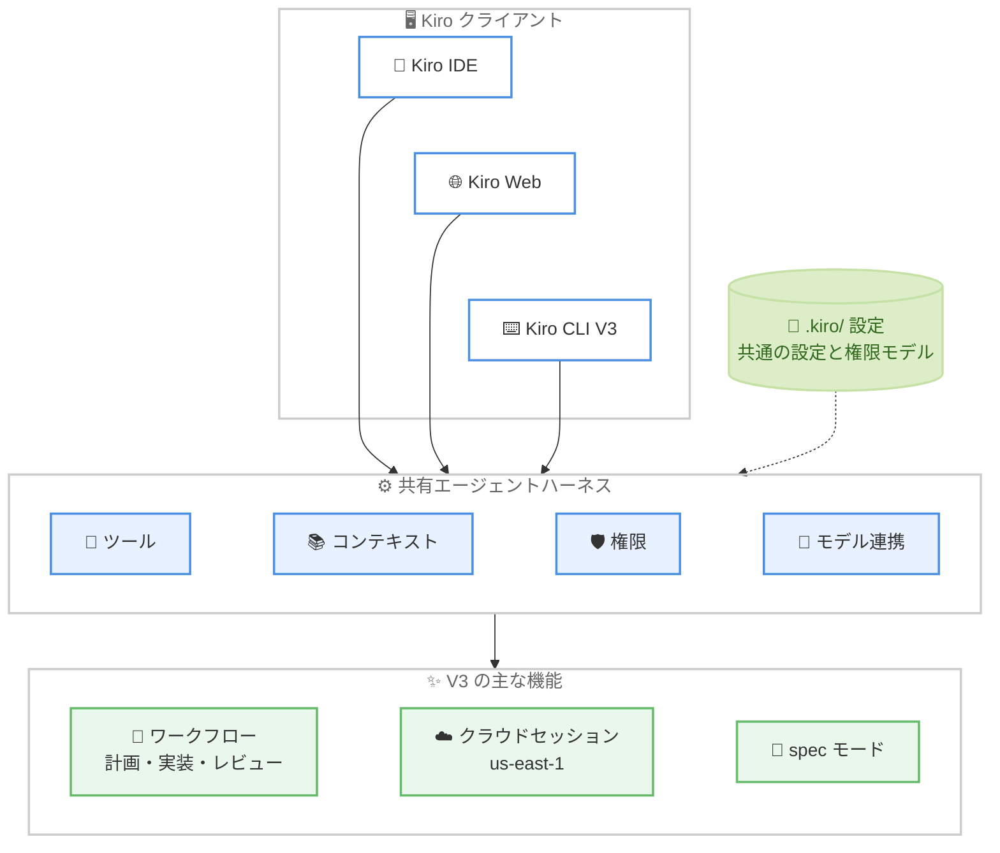

# Kiro - CLI V3 がデフォルトエクスペリエンスとしてロールアウト

**リリース日**: 2026 年 10 月 9 日
**サービス**: Kiro
**機能**: Kiro CLI V3 (デフォルトエクスペリエンス化)

📊 [このアップデートのインフォグラフィックを見る](https://takech9203.github.io/aws-news-summary/20261009-kiro-cli-3.html)

## 概要

AWS の AI 搭載 IDE である Kiro の CLI において、V3 がデフォルトエクスペリエンスとしてロールアウトされることが発表されました。Kiro CLI V3 は、Kiro IDE と Kiro Web を支えるものと同じエージェントハーネスをターミナルにもたらします。計画・実装・レビューを必要とするタスクをワークフローエージェントに委ねてバックグラウンドで進めたり、クラウドセッションを開始してラップトップを閉じても作業を継続させたりできます。新しい spec モードではコードを書き始める前に要件と設計をレビューでき、tangent モードではメインセッションのコンテキストに影響を与えずに並行した会話へ分岐できます。

V3 は 2026 年 6 月にオプトインとして導入され、その後も機能追加が続けられてきました。今回、全ユーザーのデフォルトにする準備が整い、10 月 12 日から、10 月末の CLI 3.0 リリースに先立って切り替えを促すスタートアッププロンプトが段階的に表示されます。プロンプトが表示されなくても、`kiro-cli --v3` でいつでも V3 を試せます。このロールアウトは Kiro CLI のみが対象です。

ほとんどのユーザーは、切り替えに設定変更を必要としません。エージェント、権限、インテグレーションをカスタマイズしている場合は、Kiro が自動的に移行する項目と、ユーザーの確認が必要な項目があります。また、CLI 3.0 では、インラインシェルオートコンプリートと CLI デスクトップアプリが廃止され、Classic エクスペリエンスも段階的に廃止されます。今後の新機能はターミナル UI に集中して提供されます。

**アップデート前の課題**

- V3 はオプトインであり、`kiro-cli --v3` を明示的に指定しないと利用できなかった
- V2 のエージェント設定や権限設定を V3 で利用するには、ユーザー自身での移行作業が必要だった
- ラップトップを閉じると CLI での作業が中断され、作業を継続させる手段がなかった
- 複数ステップのタスクを 1 つのセッションで進めると、レビュー担当のコンテキストに実装時の推論が混ざるなど、コンテキストの分離が難しかった

**アップデート後の改善**

- 10 月 12 日からスタートアッププロンプトが段階的に表示され、10 月末の CLI 3.0 リリースで V3 がデフォルトになる
- 移行ツールがカスタムエージェントを V2 設定を保持した「ユニバーサル設定」形式に更新し、元の設定をバックアップしたうえで、対応可能な設定を自動変換し、確認が必要な項目を警告として報告する
- `kiro-cli --cloud` によるクラウドセッション、ワークフロー、spec モード、tangent モード、Memory 管理、セッション管理ペインなどの新機能がターミナルで利用できる
- IDE、Web、CLI が同じエージェントハーネスを共有するため、新機能が全クライアントに同時に提供され、リポジトリの `.kiro/` 設定をクライアント間で再利用できる

## アーキテクチャ図



Kiro IDE、Kiro Web、Kiro CLI V3 が単一のエージェントハーネスを共有する構成を示しています。ハーネスがツール、コンテキスト、権限、モデル連携を所有し、各クライアントは独自のインターフェースを維持します。リポジトリの `.kiro/` 設定は共通の設定・権限モデルとしてクライアント間で再利用できます。

## サービスアップデートの詳細

### 主要機能

1. **クラウドセッション**
   - `kiro-cli --cloud` でクラウドセッションを開始し、リポジトリをアタッチすると、マネージドなクラウドサンドボックスで Kiro が作業する
   - 切断してもエージェントは作業を継続し、別のマシンからセッションを再開できる
   - 組織が IAM Identity Center を使用している場合、管理者が事前にクラウドセッションを有効化する必要がある
   - 現時点でクラウドセッションは米国東部 (バージニア北部) us-east-1 でのみ実行される

2. **Memory 管理**
   - Kiro がチャットセッションをまたいでコンテキストを学習する。リポジトリのコマンドや規約などをローカル V3 セッションでの作業から学習し、後のセッションで説明なしに呼び出せる
   - `/memories` で Kiro が記憶する内容を管理する
   - 詳細は同日公開の Kiro CLI 2.29.0 (Memory) のレポートを参照

3. **spec モード**
   - IDE の spec モードが CLI でも利用可能になり、実装前にアプローチをレビューできる
   - コードを書き始める前に、Kiro と要件や設計を検討できる
   - ドキュメントにインラインコメントを残し、実行するタスクを選択する操作をすべてターミナルから行える
   - `/spec new` で開始する

4. **tangent モード**
   - CLI V1 で実験的機能として導入された `/tangent` の改良版が V3 で再導入された
   - メインセッションのコンテキストに影響を与えずに、サイドスレッドで探索できる
   - 最もリクエストの多かった機能の 1 つ

5. **セッション管理ペイン**
   - 新しい `/sessions` ペインで、セッションの閲覧、ブックマーク、名前変更などが行える
   - セッション数が増えても目的のセッションを見つけやすくなる

6. **ワークフロー**
   - 複雑な複数ステップの作業を、ローカルでもクラウドでもワークフローに委任できる
   - タスクを渡すと、ワークフローがエージェントを調整して計画・実装・レビューを行う
   - 各ステップは新しいコンテキストを持つ独自のセッションで実行されるため、レビュー担当のエージェントがコーディングエージェントの推論を引き継がない
   - ワークフローの実行中もメインチャットで作業を継続でき、必要に応じて誘導や一時停止ができる
   - ワークフローはオプトインであり、初回実行前に設定で有効化する

7. **セットアップの再利用性向上**
   - グローバル Hook により、同じ自動化をワークスペース間で使い回せる
   - `AGENTS.md` ファイルをリポジトリルートだけでなくサブディレクトリにも配置でき、プロジェクトの部分ごとに異なる指示を与えられる (例: フロントエンドの規約とバックエンドのテスト指示を別ディレクトリに配置)

### 単一のエージェントハーネス

Kiro CLI V3 は、Kiro IDE と Kiro Web を支えるものと同じエージェントハーネスを使用します。ハーネスがツール、コンテキスト、権限、モデルとのやり取りを所有し、各クライアントは独自のインターフェースを維持します。

- ハーネスで構築された機能は、後から移植するのではなく、他のクライアントと同時にターミナルへ提供される。先日のワークフローのリリースは全クライアント同時提供の例
- 共有ハーネスによりクライアント間で共通の設定・権限モデルが使えるため、リポジトリの `.kiro/` 設定をクライアント間で再利用できる
- クライアントごとのサポート範囲には差があり、現在の CLI サポート状況は V3 ドキュメントに記載されている

## 技術仕様

### ロールアウトスケジュール

| 時期 | 内容 |
|------|------|
| 2026 年 6 月 | V3 をオプトインエクスペリエンスとして導入 |
| 2026 年 10 月 12 日 | 切り替えを促すスタートアッププロンプトの段階的なロールアウトを開始 |
| 2026 年 10 月末 | CLI 3.0 をリリースし、V3 がデフォルトになる |

### スタートアッププロンプトの選択肢

| 選択肢 | 動作 |
|------|------|
| Switch to V3 and upgrade my configs | V3 をデフォルトハーネスとして保存し、エージェントの自動アップグレードを有効化して、ワークスペースとグローバルのカスタムエージェント設定の移行を開始する |
| Remind me later | 切り替えを延期し、後でプロンプトを再表示する |
| Don't ask again | プロンプトの表示を停止する。ただし V2 に留まるわけではなく、10 月末の CLI 3.0 リリース時にセットアップは V3 にアップグレードされる |

### V2 からの移行内容

| 項目 | 移行時の動作 |
|------|------|
| カスタムエージェント | 元の設定を `<name>.json.bak` としてバックアップし、V2 設定を保持したまま V3 に必要な設定を追加 (ユニバーサル設定形式)。プロンプト、モデル選択、リソース、MCP サーバー定義はそのまま引き継がれる |
| Hook | 対応可能な Hook は自動変換。変換できない Hook は V3 設定から除外され、警告として報告されるため、手動での更新が必要 |
| 権限 | V2 の信頼済みツールリストとツール別設定を、アクション・リソースに対するルールへ変換。重複時はスコープに関わらず deny が ask より、ask が allow より優先される。一部のパターンは確認または手動での置き換えが必要 |
| `use_aws` ツール | V3 には存在しない。AWS CLI コマンドはシェルツール経由で実行され、シェルの承認ルールに従う。`use_aws` の allow / deny 設定はシェル権限ルールとして再作成する |
| `--trust-all-tools` | V3 でも引き続きサポート |
| セッション | V2 セッションは V3 で再開できるが、V3 で作成したセッションは V2 で再開できない |

### 廃止される機能 (CLI 3.0)

| 機能 | 内容 |
|------|------|
| インラインシェルオートコンプリート | CLI 3.0 のロールアウトとともに利用不可になる |
| CLI デスクトップアプリ | CLI 3.0 のロールアウトとともに利用不可になる |
| Classic エクスペリエンス | V3 では非サポートで、段階的に廃止。新機能はターミナル UI で提供される。エイリアスやショートカットから `--classic` を削除して `kiro-cli` を起動する |

## 設定方法

### 前提条件

1. Kiro CLI をインストールしていること
2. エージェント、権限、インテグレーションをカスタマイズしている場合は、移行内容を確認する準備があること
3. クラウドセッションを利用する場合、IAM Identity Center を使用する組織では管理者が事前に有効化していること

### 手順

#### ステップ 1: V3 を試す

```bash
kiro-cli --v3
```

新しいセッションで V3 を起動します。スタートアッププロンプトの表示を待つ必要はなく、いつでも試せます。CLI 3.0 がリリースされて V3 がデフォルトになった後は、`--v3` フラグは不要になります。

#### ステップ 2: カスタムエージェントを移行する

```
/upgrade-agent
```

移行プロンプトを受け入れると、Kiro が各設定を `<name>.json.bak` としてバックアップし、ユニバーサル設定形式へ変換します。移行を自分で実行またはやり直す場合は `/upgrade-agent` を使用します。チームがエージェントを中央リポジトリで管理している場合は、v2.29 以降で以下のコマンドによりディレクトリ全体を一括アップグレードできます。

```bash
# 変更と警告をプレビュー
kiro-cli agent upgrade <dir> --dry-run

# 実際にアップグレード
kiro-cli agent upgrade <dir>
```

`--dry-run` で変更内容と警告を事前に確認します。このコマンドは V2 形式のままのエージェントのみを書き換え、すでに V3 セクションを持つエージェントは変更しません。

#### ステップ 3: 権限の移行結果を確認する

```
/upgrade-agent diagnostics
```

移行後に診断を実行し、変換の警告に対応してから移行済みルールを利用します。`use_aws` を使用していたエージェントは、allow / deny 設定をシェル権限ルールとして再作成します。`aws *` のような広いパターンの許可は避け、具体的なルールを保ちます。

#### ステップ 4: ACP インテグレーションを更新する (該当する場合)

```bash
kiro-cli acp --agent-engine=v3
```

エージェント設定の移行では ACP インテグレーションは更新されません。ACP 移行ガイドに従ってクライアント側を変更し、上記コマンドで V3 の ACP サーバーを起動します。通常の CLI ターミナルユーザーはこのステップをスキップできます。

#### ステップ 5: V2 に戻す必要がある場合

```bash
kiro-cli --v2
```

このフラグはその起動のみに適用されます。V2 セッションは V3 で再開できますが、V3 で作成したセッションは V2 で再開できない点に注意します。

## メリット

### ビジネス面

- **作業の継続性**: クラウドセッションにより、ラップトップを閉じても作業が継続され、別のマシンから再開できるため、開発者の時間を有効活用できる
- **並行作業による生産性向上**: ワークフローがバックグラウンドで計画・実装・レビューを進める間、メインチャットで別の作業を継続できる
- **移行コストの低減**: 移行ツールが設定を自動変換・バックアップし、確認が必要な項目を警告するため、ほとんどのユーザーは設定変更なしで切り替えられる

### 技術面

- **単一ハーネスによる一貫性**: IDE、Web、CLI が同じエージェントハーネスを共有し、新機能が全クライアントに同時提供され、`.kiro/` 設定を再利用できる
- **コンテキストの分離**: ワークフローの各ステップが新しいコンテキストの独立したセッションで実行され、レビューがコーディングの推論に影響されない。tangent モードもメインセッションのコンテキストを保護する
- **実装前のレビュー**: spec モードにより、要件と設計をターミナル上でレビュー・コメントしてから実装に進められる

## デメリット・制約事項

### 制限事項

- クラウドセッションは現時点で米国東部 (バージニア北部) us-east-1 でのみ実行される
- IAM Identity Center を使用する組織では、管理者がクラウドセッションを有効化するまで利用できない
- V3 で作成したセッションは V2 で再開できない (V2 セッションの V3 での再開は可能)
- CLI 3.0 でインラインシェルオートコンプリート、CLI デスクトップアプリが廃止され、Classic エクスペリエンスも段階的に廃止される
- 「Don't ask again」を選択しても V2 に留まることはできず、CLI 3.0 リリース時に V3 へアップグレードされる

### 考慮すべき点

- 変換できない Hook は V3 設定から除外されるため、警告を確認して手動で更新する必要がある
- V3 には `use_aws` ツールがなく、AWS CLI コマンドはシェルツール経由になるため、allow / deny 設定をシェル権限ルールとして再作成する必要がある。`aws *` のような広い許可パターンは避ける
- 権限モデルが信頼済みツールリストからルールベースに変わるため、移行後は `/upgrade-agent diagnostics` で変換警告に対応してからルールに依存する
- ワークフローはオプトインであり、初回実行前に設定での有効化が必要
- ACP インテグレーションは自動移行されないため、ACP 移行ガイドに従った対応が必要

## ユースケース

### ユースケース 1: 退勤後も続くクラウドセッションでの長時間タスク

**シナリオ**: 大規模なリファクタリングを Kiro に任せたいが、ラップトップを閉じると作業が中断してしまう。

**実装例**:
```
1. 管理者が IAM Identity Center でクラウドセッションを有効化 (該当組織の場合)
2. kiro-cli --cloud でクラウドセッションを開始し、リポジトリをアタッチ
3. タスクを依頼してラップトップを閉じる
4. 翌日、別のマシンからセッションを再開して結果を確認
```

**効果**: マネージドなクラウドサンドボックスでエージェントが作業を継続するため、ローカルマシンを起動し続ける工夫が不要になる。

### ユースケース 2: ワークフローによる計画・実装・レビューの自動化

**シナリオ**: 計画、実装、レビューという複数ステップが必要な機能追加を、コンテキストを分離しながら進めたい。

**実装例**:
```
1. 設定でワークフローを有効化 (オプトイン)
2. 機能追加のタスクをワークフローに渡す
3. 各ステップが新しいコンテキストの独立したセッションで実行される
4. ワークフローの実行中はメインチャットで別の作業を継続し、
   必要に応じて誘導・一時停止する
```

**効果**: レビュー担当のエージェントがコーディングエージェントの推論を引き継がないため、独立した視点でのレビューが期待でき、ユーザーはその間も作業を継続できる。

### ユースケース 3: チームのエージェント設定の一括移行

**シナリオ**: チームがカスタムエージェントを中央リポジトリで管理しており、V3 への移行を計画的に進めたい。

**実装例**:
```
1. kiro-cli agent upgrade <dir> --dry-run で変更と警告をプレビュー
2. 変換できない Hook や権限パターンの警告を確認し、対応方針を決定
3. kiro-cli agent upgrade <dir> で一括アップグレード
   (V2 形式のエージェントのみ書き換え、バックアップを作成)
4. /upgrade-agent diagnostics で変換警告に対応
```

**効果**: ディレクトリ単位の一括移行とドライランにより、10 月末の CLI 3.0 リリース前にチーム全体の設定を計画的に V3 対応にできる。

## 利用可能リージョン

Kiro はグローバルに利用可能なサービスです。ただし、クラウドセッションは現時点で米国東部 (バージニア北部) us-east-1 でのみ実行されます。

## 関連サービス・機能

- **Kiro IDE / Kiro Web**: CLI V3 と同じエージェントハーネスを共有するクライアント。新機能は全クライアントに同時提供され、リポジトリの `.kiro/` 設定を再利用できる
- **Kiro CLI 2.29.0 (Memory)**: 同日 (2026 年 10 月 9 日) に Changelog で発表された、チャットセッションをまたぐ Memory 機能。V3 のハイライトの 1 つであり、`kiro-cli agent upgrade <dir>` などの移行支援機能も 2.29.0 で提供されている
- **AWS IAM Identity Center**: 組織でクラウドセッションを利用する際に、管理者による事前の有効化が必要
- **AWS CLI**: V3 では `use_aws` ツールが廃止され、AWS CLI コマンドはシェルツール経由で実行される

## 参考リンク

- 📊 [インフォグラフィック](https://takech9203.github.io/aws-news-summary/20261009-kiro-cli-3.html)
- [Kiro Blog - Kiro CLI V3 is rolling out as the default experience](https://kiro.dev/blog/cli-3/)
- [Kiro Changelog](https://kiro.dev/changelog/)
- [Kiro ドキュメント](https://kiro.dev/docs/)

## まとめ

Kiro CLI V3 のデフォルト化は、IDE、Web、CLI を単一のエージェントハーネスに統合するという Kiro の方向性を決定づけるアップデートです。クラウドセッション、ワークフロー、spec モード、tangent モード、Memory など、ターミナルでのエージェント活用を大きく広げる機能が揃っています。10 月末の CLI 3.0 リリースを待たずに `kiro-cli --v3` で V3 を試し、カスタムエージェントや権限、`use_aws`、Hook の移行警告など、確認が必要な項目に早めに対応しておくことを推奨します。
