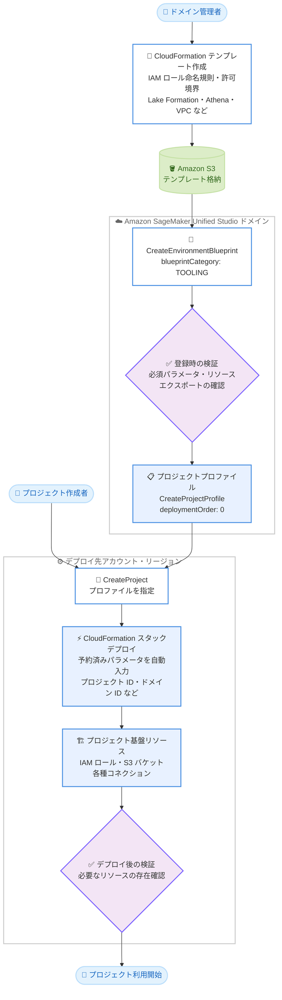

# Amazon SageMaker Unified Studio - カスタム Tooling blueprint のサポート

**リリース日**: 2026 年 10 月 9 日
**サービス**: Amazon SageMaker Unified Studio
**機能**: カスタム Tooling blueprint (Custom Tooling blueprints)

📊 [このアップデートのインフォグラフィックを見る](https://takech9203.github.io/aws-news-summary/20261009-sagemaker-custom-tooling-blueprints.html)

## 概要

Amazon SageMaker Unified Studio がカスタム Tooling blueprint をサポートしました。ドメイン管理者は、独自の AWS CloudFormation テンプレートを使用して、すべてのプロジェクトの基盤 (Tooling 環境) を定義できるようになりました。これにより、会社の命名規則に準拠した IAM ロール名の使用や、AWS マネージドポリシーの代わりにカスタム許可境界 (permissions boundary) を適用するなど、組織固有の要件に合わせたプロジェクト環境を構築できます。

管理者は CloudFormation テンプレートを作成し、カスタム Tooling blueprint として登録します。サービスは登録時と各プロジェクトのデプロイ後にテンプレートを検証し、チームメンバーがプロジェクトを使用する前に必要なリソースが存在することを確認します。テンプレートには Lake Formation グラント、Athena ワークグループ、VPC セキュリティグループなど、CloudFormation がサポートする任意のリソースを含めることができます。

デプロイ時には、プロジェクト ID やドメイン ID などの予約済みテンプレートパラメータがサービスによって自動入力されるため、単一のテンプレートを複数の AWS アカウント・リージョンにわたってプロジェクトごとの編集なしで再利用できます。ガバナンス要件の厳しいエンタープライズ環境で SageMaker Unified Studio を導入する組織にとって重要なアップデートです。

**アップデート前の課題**

- 以前は、マネージド Tooling blueprint がすべてのプロジェクトに対して固定のリソースセットをプロビジョニングしており、組織固有の要件に合わせたカスタマイズができなかった
- IAM ロール名が自動生成されるため、会社の命名規則に準拠できなかった
- AWS マネージドポリシーが適用されるため、カスタム許可境界など組織独自のセキュリティ統制を適用できなかった
- プロジェクト作成時に Lake Formation グラントや Athena ワークグループなどの追加リソースを自動プロビジョニングするには、別途の仕組みが必要だった

**アップデート後の改善**

- 今回のアップデートにより、独自の CloudFormation テンプレートでプロジェクトの基盤を定義できるようになった
- IAM ロール名や許可境界など、組織のガバナンス要件に準拠したプロジェクト環境を自動構築できるようになった
- CloudFormation がサポートする任意のリソースをプロジェクト作成時に自動プロビジョニングできるようになった
- 予約済みパラメータの自動入力により、単一のテンプレートを複数アカウント・複数リージョンで編集なしに再利用できるようになった

## アーキテクチャ図



ドメイン管理者が作成した CloudFormation テンプレートをカスタム Tooling blueprint として登録し、プロジェクト作成時に予約済みパラメータが自動入力されてデプロイされる流れを示しています。登録時とデプロイ後の 2 回の検証により、プロジェクト基盤の整合性が保証されます。

## サービスアップデートの詳細

### 主要機能

1. **独自 CloudFormation テンプレートによるプロジェクト基盤の定義**
   - マネージド Tooling blueprint の代わりに、カスタム blueprint をプロジェクトの Tooling 環境として使用可能
   - blueprint 作成時に `TOOLING` カテゴリを指定して登録
   - 会社の命名規則に準拠した IAM ロール名、カスタム許可境界などの組織要件を反映可能
   - Lake Formation グラント、Athena ワークグループ、VPC セキュリティグループなど、CloudFormation がサポートする任意のリソースを追加可能

2. **2 段階のテンプレート検証**
   - 登録時: `cloudformation:GetTemplateSummary` によりテンプレートを検証し、必須パラメータ・リソース・エクスポートの宣言を確認
   - デプロイ後: 各プロジェクトのデプロイ後に、チームメンバーが使用する前に必要なリソースが存在することを確認

3. **予約済みテンプレートパラメータの自動入力**
   - デプロイ時にドメイン ID (`datazoneEnvironmentDomainId`)、環境 ID (`datazoneEnvironmentEnvironmentId`)、プロジェクト ID (`datazoneEnvironmentProjectId`) などをサービスが自動入力
   - 単一のテンプレートを複数の AWS アカウント・リージョンにわたって、プロジェクトごとの編集なしで再利用可能
   - blueprint 作成時に追加の CloudFormation パラメータをユーザーパラメータとしてマッピングすることも可能

4. **プロジェクトプロファイルとの統合**
   - カスタム Tooling blueprint をプロジェクトプロファイルに組み込み、プロファイルからプロジェクトを作成
   - Tooling 環境には `deploymentMode: ON_CREATE`、`deploymentOrder: 0` を指定し、プロファイル内で最初にデプロイ
   - アカウントプールをターゲットにすることも可能

## 技術仕様

### テンプレートの必須要件

| 項目 | 詳細 |
|------|------|
| 必須パラメータ | `datazoneEnvironmentDomainId` (ドメイン ID)、`datazoneEnvironmentEnvironmentId` (環境 ID)、`datazoneEnvironmentProjectId` (プロジェクト ID) |
| 必須リソース | `DefaultIAMConnection` (ツールが認証に使用する IAM コネクション)、`DefaultS3Connection` (プライマリ S3 コネクション)、`DefaultS3SharedConnection` (`/shared/` プレフィックスの共有 S3 コネクション) |
| 必須エクスポート | `s3BucketArn` (プロジェクトの S3 バケット ARN)、`s3BucketPath` (他の環境がパスを解決する `s3://` URI)。エクスポート名にはプロジェクト ID とスコープ名のサフィックスを付与 |
| 禁止エクスポート | `userRoleArn` はエクスポート不可 (プロジェクトロールは IAM コネクションの `RoleArn` から解決されるため) |
| IAM コネクション名 | `default.iam` (IAM ベースのドメイン) または `project.iam` (IAM Identity Center ベースのドメイン) のみ許可。名前がプロジェクト体験を決定 |
| テンプレート格納先 | Amazon S3 (プロビジョニングロールがアクセス可能なバケット。`amazon-sagemaker-cf-templates` で始まるバケット名には `SageMakerStudioProjectProvisioningRolePolicy` が `s3:GetObject` を許可) |
| 検証方法 | 登録時に `cloudformation:GetTemplateSummary` を呼び出して検証、デプロイ後にもリソースの存在を確認 |

### API 変更履歴

| 日付 | サービス | 変更内容 |
|------|----------|----------|
| 2026/09/24 | [datazone](https://awsapichanges.com/archive/changes/60d28e-datazone.html) | 5 updated api methods - `CreateEnvironmentBlueprint`、`UpdateEnvironmentBlueprint`、`GetEnvironmentBlueprint`、`ListEnvironmentBlueprints` で `TOOLING` blueprint カテゴリをサポート。`CreateConnection` の `iamProperties` で `roleArn` を受け付けるように変更 |

### プロビジョニングロールの信頼ポリシー

SageMaker Unified Studio は blueprint のプロビジョニングロールでテンプレートをデプロイするため、ロールの信頼ポリシーで `datazone.amazonaws.com` サービスプリンシパルに対して `sts:AssumeRole` と `sts:TagSession` を許可する必要があります。

```json
{
  "Version": "2012-10-17",
  "Statement": [
    {
      "Effect": "Allow",
      "Principal": {
        "Service": "datazone.amazonaws.com"
      },
      "Action": [
        "sts:AssumeRole",
        "sts:TagSession"
      ]
    }
  ]
}
```

## 設定方法

### 前提条件

1. SageMaker Unified Studio ドメインが作成済みであり、ドメイン管理者権限を持っていること
2. 必須パラメータ・リソース・エクスポートを含む CloudFormation テンプレートを作成し、Amazon S3 にアップロード済みであること
3. 信頼ポリシーを設定したプロビジョニングロールが用意されていること

### 手順

#### ステップ 1: カスタム Tooling blueprint の登録

```bash
aws datazone create-environment-blueprint \
  --domain-identifier <domain-id> \
  --name <blueprint-name> \
  --blueprint-category TOOLING \
  --provisioning-properties '{
    "cloudFormation": {
      "templateUrl": "https://amazon-sagemaker-cf-templates-<region>-<suffix>.s3.<region>.amazonaws.com/tooling-template.yaml"
    }
  }'
```

S3 にアップロードした CloudFormation テンプレートを、`TOOLING` カテゴリのカスタム blueprint として登録します。この時点で `cloudformation:GetTemplateSummary` によるテンプレート検証が実行されます。必要に応じて `--user-parameters` で追加の CloudFormation パラメータをユーザーパラメータとしてマッピングできます。

#### ステップ 2: blueprint の有効化

```bash
aws datazone put-environment-blueprint-configuration \
  --domain-identifier <domain-id> \
  --environment-blueprint-identifier <blueprint-id> \
  --enabled-regions <region> \
  --provisioning-role-arn <provisioning-role-arn>
```

作成直後の blueprint は無効状態のため、デプロイ先の AWS アカウント・リージョンでプロビジョニングロールを指定して有効化します。SageMaker Unified Studio はこのロールを引き受けてテンプレートをデプロイします。

#### ステップ 3: プロジェクトプロファイルの作成

```bash
aws datazone create-project-profile \
  --domain-identifier <domain-id> \
  --name <profile-name> \
  --status ENABLED \
  --environment-configurations '[
    {
      "name": "CustomTooling",
      "environmentBlueprintId": "<blueprint-id>",
      "deploymentMode": "ON_CREATE",
      "deploymentOrder": 0,
      "awsAccount": { "awsAccountId": "<account-id>" },
      "awsRegion": { "regionName": "<region>" }
    }
  ]'
```

カスタム Tooling blueprint を組み込んだプロジェクトプロファイルを作成します。Tooling 環境は `deploymentMode: ON_CREATE`、`deploymentOrder: 0` とし、プロファイル内で最初にデプロイされるようにします。`--status ENABLED` の指定を忘れると、プロファイルが無効状態で作成されプロジェクト作成に使用できない点に注意してください。

#### ステップ 4: プロジェクトの作成

```bash
aws datazone create-project \
  --domain-identifier <domain-id> \
  --name <project-name> \
  --project-profile-id <profile-id>
```

プロファイルを参照してプロジェクトを作成します。デプロイ時には予約済みパラメータ (ドメイン ID、環境 ID、プロジェクト ID など) が自動入力されます。IAM ベースのドメインでは `--project-execution-role` でプロジェクトロールの ARN を渡し、テンプレートは予約済みパラメータ `datazoneEnvironmentProjectExecutionRoleArn` でこれを受け取ります。IAM Identity Center ベースのドメインでは、テンプレート自身がプロジェクトロールを作成するため指定不要です。

## メリット

### ビジネス面

- **ガバナンス要件への準拠**: 会社の命名規則に準拠した IAM ロール名やカスタム許可境界を適用でき、エンタープライズのセキュリティ・コンプライアンス要件を満たしながら SageMaker Unified Studio を導入できる
- **プロジェクト立ち上げの標準化と高速化**: 組織標準のプロジェクト基盤がプロジェクト作成時に自動構築されるため、手動セットアップによる遅延や設定ミスを排除できる
- **運用コストの削減**: 単一のテンプレートを複数アカウント・リージョンで再利用できるため、プロジェクトごとの個別対応が不要になり管理負荷が軽減される

### 技術面

- **Infrastructure as Code による一元管理**: プロジェクト基盤を CloudFormation テンプレートとしてバージョン管理でき、変更履歴の追跡とレビューが可能になる
- **任意リソースの自動プロビジョニング**: Lake Formation グラント、Athena ワークグループ、VPC セキュリティグループなど、CloudFormation がサポートする任意のリソースをプロジェクト作成フローに組み込める
- **2 段階検証による信頼性**: 登録時とデプロイ後の検証により、不完全なテンプレートの登録や、必要なリソースが欠けた状態でのプロジェクト利用を防止できる
- **予約済みパラメータによる再利用性**: プロジェクト ID やドメイン ID が自動入力されるため、環境ごとのテンプレート編集が不要になる

## デメリット・制約事項

### 制限事項

- テンプレートは必須パラメータ (`datazoneEnvironmentDomainId` など 3 つ)、必須リソース (`DefaultIAMConnection` など 3 つのコネクション)、必須エクスポート (`s3BucketArn`、`s3BucketPath`) を宣言する必要がある
- CloudFormation エクスポート `userRoleArn` は使用できない (サービスが IAM コネクションの `RoleArn` からプロジェクトロールを解決するため)
- デフォルト IAM コネクションの名前は `default.iam` (IAM 権限) または `project.iam` (IAM Identity Center 権限) のみ許可される
- blueprint は作成直後は無効状態であり、プロビジョニングロールを指定して明示的に有効化する必要がある

### 考慮すべき点

- CloudFormation テンプレートの作成・保守には、SageMaker Unified Studio のプロジェクト構造 (コネクション、エクスポート、予約済みパラメータ) に関する理解が必要
- マネージド Tooling blueprint が提供する機能を自前のテンプレートで再現する場合、Tooling capabilities のドキュメントを参照して必要な機能を追加する必要がある
- プロビジョニングロールの信頼ポリシーとアクセス権限 (テンプレートが作成するリソースへの権限を含む) を適切に設計する必要がある
- ドメインタイプ (IAM ベースか IAM Identity Center ベースか) によってテンプレートの構成が異なるため、環境に合わせたテンプレートを用意する必要がある

## ユースケース

### ユースケース 1: 会社の命名規則と許可境界に準拠したプロジェクトロール

**シナリオ**: 金融機関などガバナンス要件の厳しい組織で、すべての IAM ロールに会社標準の命名規則と許可境界の適用が義務付けられており、自動生成されるロール名ではセキュリティ監査を通過できない。

**実装例**:
```yaml
ProjectUserRole:
  Type: AWS::IAM::Role
  Properties:
    RoleName: !Sub 'corp-ml-usr-${datazoneEnvironmentProjectId}'
    PermissionsBoundary: !Sub 'arn:aws:iam::${AWS::AccountId}:policy/corp-permissions-boundary'
    ManagedPolicyArns:
      - !Sub 'arn:${AWS::Partition}:iam::aws:policy/SageMakerStudioProjectUserRolePolicy'
```

**効果**: すべてのプロジェクトロールが会社の命名規則と許可境界に自動的に準拠し、セキュリティ監査への対応工数を削減しながら、データサイエンティストのセルフサービスでのプロジェクト作成を実現できる。

### ユースケース 2: データ分析基盤リソースの自動プロビジョニング

**シナリオ**: データ分析チームがプロジェクト作成のたびに、Lake Formation のアクセス許可、専用の Athena ワークグループ、コスト配分タグの設定を手動で行っており、立ち上げに数日かかっている。

**実装例**:
```yaml
ProjectAthenaWorkGroup:
  Type: AWS::Athena::WorkGroup
  Properties:
    Name: !Sub 'project-${datazoneEnvironmentProjectId}'
    WorkGroupConfiguration:
      ResultConfiguration:
        OutputLocation: !Sub 's3://${ProjectBucket}/athena-results/'
      BytesScannedCutoffPerQuery: 10737418240
```

**効果**: プロジェクト作成と同時に分析基盤リソースが自動構築され、立ち上げ期間を数日から数分に短縮できる。ワークグループ単位のクエリスキャン上限によりコスト統制も自動化される。

### ユースケース 3: マルチアカウント環境での標準プロジェクト基盤の展開

**シナリオ**: 事業部ごとに AWS アカウントを分離している企業で、各アカウントに同一標準のプロジェクト環境 (VPC セキュリティグループ、ログ設定、暗号化設定) を展開したいが、アカウントごとのテンプレート編集が負担になっている。

**実装例**:
```bash
# 同一の blueprint を複数リージョン・アカウントで有効化
aws datazone put-environment-blueprint-configuration \
  --domain-identifier <domain-id> \
  --environment-blueprint-identifier <blueprint-id> \
  --enabled-regions us-east-1 ap-northeast-1 \
  --provisioning-role-arn <provisioning-role-arn>
```

**効果**: 予約済みパラメータの自動入力により、単一の CloudFormation テンプレートを複数アカウント・リージョンで編集なしに展開でき、全社で一貫したプロジェクト基盤を維持できる。

## 料金

カスタム Tooling blueprint 機能自体に追加料金はありません。CloudFormation テンプレートによってプロビジョニングされる各リソース (S3 バケット、Athena ワークグループでのクエリ実行など) に対して、通常の AWS 利用料金が発生します。

## 利用可能リージョン

Amazon SageMaker Unified Studio が利用可能なすべての AWS リージョンで利用できます。対象リージョンの一覧は [サポートリージョンのドキュメント](https://docs.aws.amazon.com/sagemaker-unified-studio/latest/adminguide/supported-regions.html) を参照してください。

## 関連サービス・機能

- **AWS CloudFormation**: カスタム Tooling blueprint のテンプレート記述とデプロイの基盤。`GetTemplateSummary` による検証にも使用される
- **Amazon DataZone**: SageMaker Unified Studio の基盤 API。`CreateEnvironmentBlueprint`、`CreateProjectProfile`、`CreateProject` などの API を提供
- **AWS IAM**: プロジェクトロール、プロビジョニングロール、許可境界など、blueprint がカスタマイズする主要な権限コンポーネント
- **AWS Lake Formation / Amazon Athena**: テンプレートに含められる代表的な分析系リソース (グラント、ワークグループ)

## 参考リンク

- 📊 [インフォグラフィック](https://takech9203.github.io/aws-news-summary/20261009-sagemaker-custom-tooling-blueprints.html)
- [公式発表 (What's New)](https://aws.amazon.com/about-aws/whats-new/2026/10/sagemaker-custom-tooling-blueprints/)
- [ドキュメント: Custom blueprints as Tooling](https://docs.aws.amazon.com/sagemaker-unified-studio/latest/adminguide/tooling-custom-blueprints.html)
- [ドキュメント: サポートリージョン](https://docs.aws.amazon.com/sagemaker-unified-studio/latest/adminguide/supported-regions.html)
- [料金ページ](https://aws.amazon.com/sagemaker/pricing/)

## まとめ

カスタム Tooling blueprint のサポートにより、SageMaker Unified Studio のプロジェクト基盤を組織のガバナンス要件に合わせて完全にカスタマイズできるようになりました。命名規則や許可境界などの理由でマネージド Tooling blueprint が採用の障壁となっていた組織は、本機能の活用を検討することを推奨します。まずはドキュメントの最小 Tooling テンプレートをベースに、組織要件を反映したテンプレートの作成から始めるとよいでしょう。
