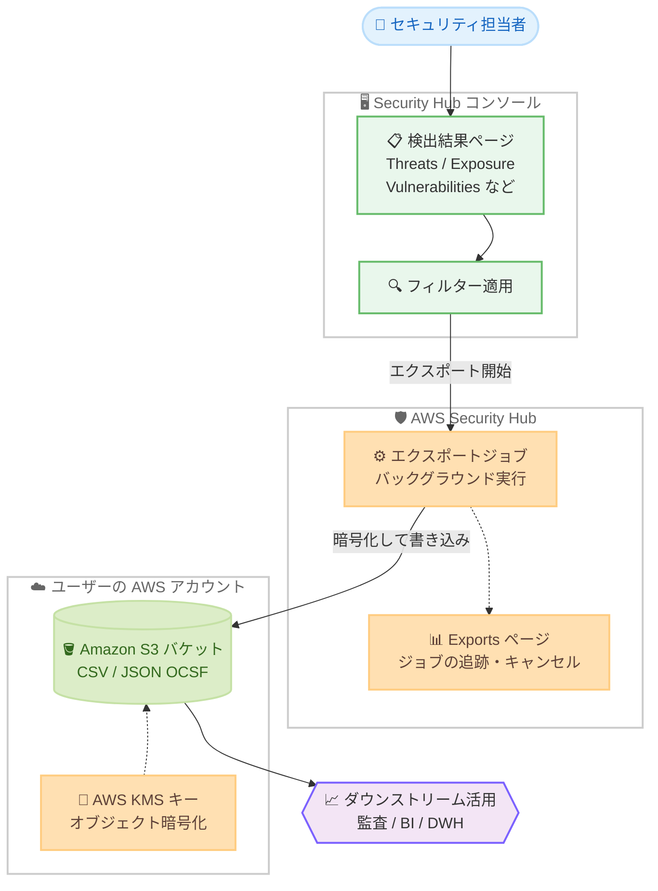

# AWS Security Hub - 検出結果の Amazon S3 エクスポート (CSV / JSON 形式)

**リリース日**: 2026 年 10 月 9 日
**サービス**: AWS Security Hub
**機能**: 検出結果 (findings) の Amazon S3 への CSV または JSON (OCSF) 形式でのエクスポート

📊 [このアップデートのインフォグラフィックを見る](https://takech9203.github.io/aws-news-summary/20261009-security-hub-exports-s3-csv-json.html)

## 概要

AWS Security Hub が、検出結果 (findings) を Amazon S3 バケットに CSV または JSON (OCSF: Open Cybersecurity Schema Framework) 形式でエクスポートする機能を発表しました。Security Hub コンソールの各検出結果ページ (All Findings、Exposure、Threats、Vulnerabilities、Sensitive Data、Posture Management) から、オンデマンドでエクスポートを開始できます。

エクスポートは、ページに適用中のフィルターをそのまま引き継いでスコープとして使用します。たとえば Vulnerabilities ページで「重要度が Critical かつステータスが New」でフィルターした状態からエクスポートを開始すると、その条件に一致する検出結果のみが出力されます。出力ファイルは自アカウントの S3 バケットに配信され、指定した AWS KMS キーで暗号化されます。

コンプライアンスレポートの作成、監査証跡の保持、データウェアハウスや BI ツールへの取り込みなど、コンソール外で検出結果を活用したいセキュリティチームに適した機能です。

**アップデート前の課題**

このアップデート以前は、Security Hub の検出結果をコンソール外で利用する際に以下の課題がありました。

- 検出結果を S3 に出力するには、EventBridge や API を使った独自の抽出パイプラインを構築・維持する必要があった
- Security Hub コンソールを使用しないチーム (監査担当、経営層など) への検出結果の共有に手間がかかった
- 特定時点の検出結果スナップショットを監査証跡として残す簡易な手段がなかった

**アップデート後の改善**

今回のアップデートにより、以下が可能になりました。

- コンソールの検出結果ページから数クリックでオンデマンドエクスポートを開始できるようになった
- 独自の抽出パイプラインの構築・維持が不要になった
- CSV (スプレッドシートでの確認・共有向け) と JSON (OCSF 形式) の 2 つの形式を用途に応じて選択できるようになった
- ページ上のフィルターがそのままエクスポートのスコープとして引き継がれ、必要な検出結果だけを出力できるようになった

## アーキテクチャ図



コンソールの検出結果ページで適用したフィルターがエクスポートのスコープとなり、Security Hub がバックグラウンドでジョブを実行して、KMS キーで暗号化した CSV または JSON ファイルをユーザー所有の S3 バケットに書き込む流れです。

## サービスアップデートの詳細

### 主要機能

1. **検出結果ページからのオンデマンドエクスポート**
   - All Findings、Exposure、Threats、Vulnerabilities、Sensitive Data、Posture Management の各ページから開始可能
   - エクスポート元のページがスコープとなり、適用中のフィルターがそのまま引き継がれる
   - フィルターは OCSF フィールドに対して適用され、引き継げないフィルターがある場合はコンソールに警告が表示される
   - エクスポートはバックグラウンドで実行され、完了すると S3 バケットにファイルが出力される

2. **CSV と JSON (OCSF) の 2 形式をサポート**
   - **CSV**: スプレッドシートでの確認やチームへの共有向け。出力する列を選択でき、各列は OCSF フィールドパス (例: `cloud.account.uid`) に対応
   - CSV のデフォルト列は 9 列: Finding title、Severity、Resource ID、Created at、Status、Finding account、Finding region、Product vendor name、Finding type
   - **JSON (OCSF)**: 検出結果の完全な内容を常に含むため、列選択は不要。OCSF 形式でのデータ連携が必要な場合に使用

3. **暗号化とエクスポートの追跡**
   - 出力されるすべてのオブジェクトは、ユーザーが指定した AWS KMS キーで暗号化される
   - Security Hub コンソールの Exports ページからすべてのエクスポートジョブを追跡できる
   - 実行中のエクスポートはキャンセル可能で、キャンセルして新しいエクスポートを開始することもできる

## 技術仕様

### エクスポート機能の仕様

| 項目 | 詳細 |
|------|------|
| エクスポート元 | All Findings、Exposure、Threats、Vulnerabilities、Sensitive Data、Posture Management の各ページ |
| 出力形式 | CSV または JSON (OCSF) |
| スコープ | エクスポート元ページと、そのページに適用中のフィルター |
| 出力先 | ユーザー所有の Amazon S3 バケット (バケットとプレフィックスを指定) |
| 暗号化 | ユーザー指定の AWS KMS キーによるオブジェクト暗号化 |
| 同時実行 | 1 アカウントにつき同時に実行できるエクスポートは 1 件 |
| 追跡 | Security Hub コンソールの Exports ページで確認・キャンセル可能 |

### API 変更履歴

| 日付 | サービス | 変更内容 |
|------|----------|----------|
| 2026/10/08 | [AWS SecurityHub](https://awsapichanges.com/archive/changes/6b8067-securityhub.html) | 4 new api methods - エクスポート用 API として `StartExportJobV2`、`GetExportJobV2`、`ListExportJobsV2`、`CancelExportJobV2` を追加 |

コンソールだけでなく、これらの API を使用してエクスポートジョブの開始、状態取得、一覧表示、キャンセルをプログラムから実行できます。

## 設定方法

### 前提条件

ドキュメントによると、エクスポートの作成には以下が必要です。

1. 出力先となる Amazon S3 バケット
2. オブジェクト暗号化に使用する AWS KMS キー
3. S3 バケットと KMS キーの両方に、Security Hub からの書き込みを許可するポリシー
4. エクスポートを作成する IAM アイデンティティへの権限付与

### 手順

#### ステップ 1: 検出結果ページでフィルターを適用

Security Hub コンソールを開き、エクスポートしたい検出結果ページ (All Findings、Exposure、Threats、Vulnerabilities、Sensitive Data、Posture Management のいずれか) を選択し、エクスポートに使用するフィルターを適用します。

#### ステップ 2: エクスポートを作成

ページ上の [Export] を選択すると、Create export ページが開きます。以下を設定します。

- **Scope**: 引き継がれたページとフィルターを確認する (変更する場合は検出結果ページに戻って調整)
- **Export name**: 後から見つけやすい名前を入力 (コンソールは `vulnerabilities-202610081601` のような名前を提案)
- **Export format**: CSV または JSON (OCSF) を選択
- **CSV columns**: CSV の場合のみ、出力する列を選択 (デフォルトは 9 列)
- **Export location**: S3 バケットを選択し、暗号化用の KMS キーを追加

#### ステップ 3: エクスポートの実行と追跡

[Create export] を選択するとエクスポートがバックグラウンドで実行され、完了すると S3 バケットにファイルが出力されます。既にエクスポートが実行中の場合は Export in progress ダイアログが表示され、完了を待つか、キャンセルして新しいエクスポートを開始するかを選択できます。進行状況は Exports ページから確認できます。

## メリット

### ビジネス面

- **コンプライアンスレポートの効率化**: 監査やコンプライアンス報告に必要な検出結果を、特定時点のスナップショットとして簡単に取得・保管できる
- **関係者への共有が容易**: Security Hub コンソールを使用しないチームにも、CSV ファイルで検出結果を共有できる
- **運用コストの削減**: 独自の抽出パイプラインの構築・維持が不要になり、開発・運用の工数を削減できる

### 技術面

- **フィルター連動のスコープ指定**: コンソール上のフィルターがそのままエクスポート条件になるため、必要なデータだけを正確に出力できる
- **OCSF 準拠の JSON 出力**: 標準スキーマである OCSF 形式で出力されるため、データウェアハウスや BI ツール、SIEM との連携が容易
- **KMS によるセキュアな保管**: 出力オブジェクトはユーザー指定の KMS キーで暗号化され、機密性の高いセキュリティデータを安全に保管できる

## デメリット・制約事項

### 制限事項

- 1 アカウントで同時に実行できるエクスポートは 1 件のみ (別のエクスポートを開始するには、実行中のエクスポートの完了を待つかキャンセルする必要がある)
- CSV の列選択は可能だが、JSON (OCSF) は常に検出結果の完全な内容を含むため列選択はできない
- エクスポート元ページのフィルターのうち、OCSF フィールドに適用できないものは引き継がれない (コンソールに警告が表示される)

### 考慮すべき点

- オンデマンド実行の機能であり、定期的な自動エクスポートが必要な場合は `StartExportJobV2` API をスケジュール実行する仕組み (EventBridge Scheduler など) との組み合わせを検討する
- S3 バケットポリシーと KMS キーポリシーの両方で Security Hub からの書き込みを許可する事前設定が必要
- エクスポートされたファイルには機密性の高いセキュリティ情報が含まれるため、出力先バケットのアクセス制御を適切に設計する必要がある

## ユースケース

### ユースケース 1: 月次コンプライアンスレポートの作成

**シナリオ**: 社内の監査チームに対して、毎月の重大な検出結果の一覧をスプレッドシートで提出する必要がある。

**実装例**:
```
1. Posture Management ページで「重要度: Critical / High」「ステータス: New」でフィルター
2. [Export] から CSV 形式を選択し、必要な列 (Finding title、Severity、Resource ID、Status など) を指定
3. 監査用 S3 バケットにエクスポートし、ファイルを監査チームに共有
```

**効果**: パイプライン開発なしで、監査要件に合わせた検出結果レポートを数分で作成できる。

### ユースケース 2: 監査証跡としての特定時点スナップショット保持

**シナリオ**: セキュリティ監査に備えて、四半期ごとの検出結果の状態を証跡として長期保管したい。

**実装例**:
```
1. All Findings ページから JSON (OCSF) 形式でエクスポート
2. 出力先 S3 バケットにライフサイクルルールと S3 オブジェクトロックを設定し、
   改ざん防止と長期保管を実現
```

**効果**: 特定時点の検出結果の完全な記録を OCSF 形式で保持でき、監査時のエビデンスとして活用できる。

### ユースケース 3: BI ツール・データウェアハウスへの取り込み

**シナリオ**: セキュリティ検出結果の傾向を Amazon QuickSight などの BI ツールで可視化し、経営層へ報告したい。

**実装例**:
```
1. 検出結果を JSON (OCSF) 形式で S3 にエクスポート
2. Amazon Athena で S3 上の OCSF データにクエリを実行
3. QuickSight でダッシュボードを作成し、重要度別・アカウント別の傾向を可視化
```

**効果**: OCSF の標準スキーマを活用して、検出結果の分析基盤を迅速に構築できる。

## 料金

What's New およびユーザーガイドには、本エクスポート機能自体の追加料金に関する記載はありません。ただし、以下の関連コストが発生する点に留意してください。

- Amazon S3 のストレージ料金およびリクエスト料金
- AWS KMS のキー管理およびリクエスト料金

詳細は [AWS Security Hub 料金ページ](https://aws.amazon.com/security-hub/pricing/) を参照してください。

## 利用可能リージョン

AWS Security Hub が利用可能なすべての AWS リージョンで利用できます。

## 関連サービス・機能

- **Amazon S3**: エクスポートの出力先。バケットポリシーで Security Hub からの書き込みを許可する必要がある
- **AWS KMS**: エクスポートされたオブジェクトの暗号化に使用。キーポリシーで Security Hub からの利用を許可する必要がある
- **Amazon Athena / Amazon QuickSight**: S3 に出力した OCSF 形式の検出結果に対するクエリ・可視化に活用できる
- **Open Cybersecurity Schema Framework (OCSF)**: JSON エクスポートで採用されている、セキュリティデータのオープン標準スキーマ

## 参考リンク

- 📊 [インフォグラフィック](https://takech9203.github.io/aws-news-summary/20261009-security-hub-exports-s3-csv-json.html)
- [公式発表 (What's New)](https://aws.amazon.com/about-aws/whats-new/2026/10/security-hub-exports-s3-csv-json/)
- [ドキュメント: Exporting findings from Security Hub to Amazon S3](https://docs.aws.amazon.com/securityhub/latest/userguide/securityhub-v2-findings-export.html)
- [API 変更履歴 (awsapichanges.com)](https://awsapichanges.com/archive/changes/6b8067-securityhub.html)
- [料金ページ](https://aws.amazon.com/security-hub/pricing/)

## まとめ

Security Hub の検出結果を、独自パイプラインなしで CSV または JSON (OCSF) 形式として S3 にエクスポートできるようになり、コンプライアンスレポート作成や監査証跡の保持、BI ツール連携が大幅に簡素化されました。コンソール外で検出結果を活用しているチームは、既存の抽出パイプラインを本機能で置き換えられないか検討することを推奨します。利用開始にあたっては、出力先 S3 バケットと KMS キーのポリシー設定を事前に確認してください。
