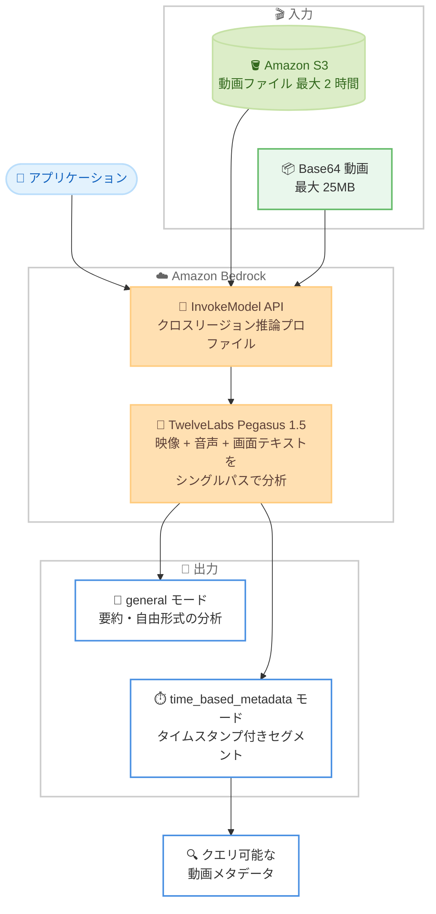

# Amazon Bedrock - TwelveLabs Pegasus 1.5 モデルの提供開始

**リリース日**: 2026 年 10 月 9 日
**サービス**: Amazon Bedrock
**機能**: TwelveLabs Pegasus 1.5 (video-to-text モデル) のサポート

📊 [このアップデートのインフォグラフィックを見る](https://takech9203.github.io/aws-news-summary/20261009-twelve-labs-pegasus-1-5-aws.html)

## 概要

Amazon Bedrock で TwelveLabs の video-to-text モデル「Pegasus 1.5」が利用可能になりました。Pegasus 1.5 は動画コンテンツから構造化されたタイムコード付きメタデータを生成するモデルで、動画の要約、詳細な説明、構造化されたレスポンスの生成に対応します。Pegasus 1.2 をベースに、動画全体を構造化されたタイムスタンプ付きメタデータに変換する動画セグメンテーション機能が追加されています。

編集セグメント、話者の交代、スポーツのプレー、ブランドの登場など、ビジネス上重要な要素を定義すると、Pegasus 1.5 が動画全体からそれらの瞬間を見つけ、タイムスタンプ付きで返します。映像、音声、画面上のテキストをシングルパスで分析するため、事前のインデックス作成やインジェストパイプラインの構築は不要です。メディア・エンターテインメント、スポーツ、広告、マーケティングなど、大規模な動画ライブラリを扱う組織に有用なアップデートです。

本モデルは US および Global クロスリージョン推論プロファイル経由でのみ利用可能で、Global プロファイルは東京リージョンや大阪リージョンを含む世界中のリージョンからアクセスできます。

**アップデート前の課題**

- 大規模な動画ライブラリから特定の瞬間を見つけるには、事前にどこを探すべきかを知っている必要があった
- 動画を検索可能にするには、事前のインデックス作成やインジェストパイプラインの構築が必要だった
- 映像、音声、画面上のテキストを個別のツールで分析し、結果を統合する手間がかかっていた
- Pegasus 1.2 では動画全体にわたる構造化されたセグメント抽出 (動画セグメンテーション) ができなかった

**アップデート後の改善**

- 動画全体を読み取り、何がいつ起こるかをラベル付けして、アプリケーションがクエリ可能なデータに変換できるようになった
- `time_based_metadata` モードでビジネス上重要なセグメント定義を指定するだけで、該当する瞬間がタイムスタンプ付きで返されるようになった
- 見るもの、聞くもの、画面上のテキストをシングルパスで分析でき、事前のインデックス作成が不要になった
- JSON Schema による構造化出力 (`responseFormat`) に対応し、アプリケーションへの組み込みが容易になった

## アーキテクチャ図



S3 または Base64 形式の動画を InvokeModel API 経由で Pegasus 1.5 に渡すと、自由形式の分析 (general モード) またはタイムスタンプ付きの構造化セグメント (time_based_metadata モード) が返されます。

## サービスアップデートの詳細

### 主要機能

1. **動画セグメンテーション (time_based_metadata モード)**
   - `analysis_mode` に `time_based_metadata` を指定し、`segment_definitions` で抽出したいセグメントタイプを定義する
   - 各セグメント定義には `id`、`description`、およびセグメントごとに取得するフィールド (`name`、`type`、`description`) を指定する
   - レスポンスの `segments` 配列に、開始秒 (`start_sec`) と終了秒 (`end_sec`) 付きでセグメントが返される
   - 編集セグメント、話者の交代、スポーツのプレー、ブランドの登場など、ビジネス固有の定義で抽出可能

2. **自由形式の動画分析 (general モード)**
   - `inputPrompt` に自然言語のプロンプトを指定し、動画の要約や詳細な説明を生成する
   - `responseFormat.jsonSchema` を指定することで、JSON Schema に準拠した構造化出力を取得できる
   - レスポンスストリーミング (InvokeModelWithResponseStream) に対応

3. **マルチモーダルなシングルパス分析**
   - 映像、音声、画面上のテキストを 1 回の処理でまとめて分析する
   - 事前のインデックス作成やインジェストパイプラインの構築が不要
   - 入力は S3 の動画 (最大 2 時間、2GB 未満) または Base64 エンコード動画 (最大 25MB) に対応

## 技術仕様

### モデル仕様

| 項目 | 詳細 |
|------|------|
| モデル ID | `twelvelabs.pegasus-1-5-v1:0` |
| US Geo 推論プロファイル ID | `us.twelvelabs.pegasus-1-5-v1:0` |
| Global 推論プロファイル ID | `global.twelvelabs.pegasus-1-5-v1:0` |
| 入力モダリティ | テキスト、動画 |
| 出力モダリティ | テキスト |
| 対応 API | InvokeModel、InvokeModelWithResponseStream (Converse 非対応) |
| エンドポイント | bedrock-runtime |
| 推論方式 | クロスリージョン推論のみ (In-Region オンデマンド推論は非対応) |
| サービスティア | Standard のみ (Priority、Flex、Reserved は非対応) |
| 動画入力 (S3) | 最大 2 時間、2GB 未満 |
| 動画入力 (Base64) | 最大 25MB |
| maxOutputTokens | 最小 512、最大 98,304 |
| temperature | デフォルト 0.2、最小 0、最大 1 |

### 主要なリクエストパラメータ

| パラメータ | 必須 | 説明 |
|------------|------|------|
| `analysis_mode` | いいえ | `general` (デフォルト) または `time_based_metadata` |
| `inputPrompt` | 条件付き | `general` モード時に必須。動画分析のプロンプト |
| `mediaSource` | はい | `base64String` または `s3Location` で動画を指定 |
| `segment_definitions` | 条件付き | `time_based_metadata` モード時に必須。抽出するセグメントタイプの定義 |
| `responseFormat` | いいえ | JSON Schema による構造化出力の指定 (`general` モード) |

### レスポンスフィールド

| フィールド | 説明 |
|------------|------|
| `message` | 動画分析結果のテキスト。`responseFormat.jsonSchema` 指定時は JSON 文字列 |
| `segments` | `time_based_metadata` モード時に返されるセグメントの配列 (時間範囲付き) |
| `definition_errors` | 処理できなかったセグメント定義の一覧 (すべて成功時は空配列) |
| `stopReason` | 生成終了理由。`stop` または `length` (Pegasus 1.2 の `finishReason` から変更) |

## 設定方法

### 前提条件

1. AWS アカウントと Amazon Bedrock へのアクセス権限
2. Amazon Bedrock コンソールでの TwelveLabs Pegasus 1.5 モデルアクセスの有効化
3. 分析対象の動画を格納した S3 バケット (S3 入力を使用する場合)

### 手順

#### ステップ 1: モデルアクセスの有効化

Amazon Bedrock コンソールの [モデルアクセス] から TwelveLabs Pegasus 1.5 へのアクセスをリクエストします。本モデルは AWS Marketplace 経由で提供されるサードパーティモデルです。

#### ステップ 2: 動画の要約を生成する (general モード)

```python
import json
import boto3

client = boto3.client('bedrock-runtime', region_name='us-east-1')
response = client.invoke_model(
    modelId='us.twelvelabs.pegasus-1-5-v1:0',
    body=json.dumps({
        'analysis_mode': 'general',
        'inputPrompt': 'Summarize this video and list key scenes with timestamps',
        'mediaSource': {
            's3Location': {
                'uri': 's3://your-bucket/your-video.mp4',
                'bucketOwner': '123456789012'
            }
        },
        'temperature': 0.2,
        'maxOutputTokens': 2048
    })
)
print(json.loads(response['body'].read()))
```

US クロスリージョン推論プロファイル ID を指定して InvokeModel API を呼び出し、S3 上の動画の要約とキーシーンを生成しています。`bucketOwner` には S3 バケット所有者の AWS アカウント ID を指定します。

#### ステップ 3: タイムスタンプ付きメタデータを抽出する (time_based_metadata モード)

```python
import json
import boto3

client = boto3.client('bedrock-runtime', region_name='us-east-1')
response = client.invoke_model(
    modelId='us.twelvelabs.pegasus-1-5-v1:0',
    body=json.dumps({
        'analysis_mode': 'time_based_metadata',
        'mediaSource': {
            's3Location': {
                'uri': 's3://your-bucket/your-video.mp4',
                'bucketOwner': '123456789012'
            }
        },
        'maxOutputTokens': 4096,
        'temperature': 0,
        'segment_definitions': [
            {
                'id': 'scenes',
                'description': 'What happens in this segment',
                'fields': [
                    {
                        'name': 'summary',
                        'type': 'string',
                        'description': 'What happens in the segment'
                    }
                ]
            }
        ]
    })
)
print(json.loads(response['body'].read()))
```

`segment_definitions` で抽出したいセグメントの定義を指定し、動画全体から該当セグメントを `start_sec` と `end_sec` 付きで抽出しています。レスポンスの `segments` 配列をパースすることで、アプリケーションから動画の各瞬間をクエリできます。

## メリット

### ビジネス面

- **動画アーカイブの資産価値向上**: 大規模な動画ライブラリをクエリ可能なデータに変換することで、過去の映像資産を検索・再利用しやすくなる
- **手作業によるタグ付けコストの削減**: 人手によるロギングやメタデータ付与の作業を自動化し、運用コストを削減できる
- **ビジネス固有の要件に対応**: 編集セグメント、話者の交代、スポーツのプレー、ブランドの登場など、組織ごとに重要な要素を自由に定義できる

### 技術面

- **パイプライン構築が不要**: 事前のインデックス作成やインジェストパイプラインを構築せず、InvokeModel API の呼び出しのみで動画分析を実行できる
- **構造化出力への対応**: JSON Schema による構造化出力やタイムスタンプ付きセグメントにより、後続のアプリケーションやデータベースへの統合が容易
- **マルチモーダルなシングルパス分析**: 映像、音声、画面上のテキストを個別に処理する必要がなく、1 回の API 呼び出しで統合的な分析結果を取得できる

## デメリット・制約事項

### 制限事項

- クロスリージョン推論のみの提供であり、In-Region オンデマンド推論は非対応
- Converse API には非対応 (InvokeModel / InvokeModelWithResponseStream のみ)
- Guardrails、Knowledge Bases、Agents、モデル評価などの Bedrock 機能には非対応
- S3 入力は最大 2 時間 (2GB 未満)、Base64 入力は最大 25MB という動画サイズの制限がある
- サービスティアは Standard のみで、Priority、Flex、Reserved は選択できない

### 考慮すべき点

- Global クロスリージョン推論プロファイルを使用する場合、リクエストが世界中のリージョンにルーティングされるため、データレジデンシー要件がある場合は US Geo プロファイルの利用を検討する必要がある
- Pegasus 1.2 からレスポンスのフィールド名が変更されており (`finishReason` から `stopReason`)、移行時にはアプリケーションの修正が必要
- サードパーティモデルのため、請求は Amazon Bedrock ではなくモデルプロバイダー (AWS Marketplace) 名義で AWS 請求書に表示される

## ユースケース

### ユースケース 1: 放送・メディアアーカイブの検索基盤

**シナリオ**: 放送局が数十年分の映像アーカイブを保有しているが、特定のシーンを探すには担当者の記憶や手作業のログに依存している。

**実装例**:
```
1. アーカイブ動画を S3 に格納
2. time_based_metadata モードで「ニュースセグメント」「インタビュー」「スポーツハイライト」などのセグメント定義を指定して一括分析
3. 返されたタイムスタンプ付きメタデータを Amazon OpenSearch Service などに格納
4. 編集者がキーワードや出来事で該当シーンを秒単位で検索
```

**効果**: アーカイブ全体が検索可能になり、番組制作時の素材探しの時間を大幅に短縮できる。

### ユースケース 2: スポーツ映像の自動ハイライト抽出

**シナリオ**: スポーツ配信事業者が試合映像からゴール、反則、選手交代などの重要プレーを抽出し、ハイライト動画や統計データを生成したい。

**実装例**:
```
segment_definitions に以下を定義:
- id: "goals" (得点シーンの検出)
- id: "fouls" (反則シーンの検出)
- id: "substitutions" (選手交代の検出)
各フィールドに選手名や状況説明を含めて抽出
```

**効果**: 試合終了後すぐにタイムスタンプ付きのプレー一覧が得られ、ハイライト編集やデータ分析を自動化できる。

### ユースケース 3: 広告・ブランド露出の分析

**シナリオ**: マーケティング部門が、スポンサー映像やイベント動画内で自社ブランドロゴや商品がいつ・どれだけ登場したかを計測したい。

**実装例**:
```
segment_definitions に「ブランドの登場」セグメントを定義し、
フィールドとしてブランド名、露出の種類 (ロゴ、商品、言及) を指定。
画面上のテキストと音声の言及もシングルパスで検出。
```

**効果**: ブランド露出時間の定量化が自動化され、スポンサーシップの効果測定レポートを迅速に作成できる。

## 料金

TwelveLabs Pegasus 1.5 は AWS Marketplace 経由で提供・請求されるサードパーティモデルです。料金は AWS 請求書および AWS Cost Explorer 上で、Amazon Bedrock ではなくモデルプロバイダー名義で表示されます。最新の料金は [Amazon Bedrock 料金ページ](https://aws.amazon.com/bedrock/pricing/)を参照してください。

## 利用可能リージョン

クロスリージョン推論のみで提供されます (In-Region 推論は非対応)。

- **US Geo クロスリージョン推論プロファイル** (`us.twelvelabs.pegasus-1-5-v1:0`): us-east-1 (バージニア北部)、us-east-2 (オハイオ)、us-west-1 (北カリフォルニア)、us-west-2 (オレゴン) から利用可能
- **Global クロスリージョン推論プロファイル** (`global.twelvelabs.pegasus-1-5-v1:0`): 上記 US リージョンに加え、ap-northeast-1 (東京)、ap-northeast-3 (大阪) を含む世界中の 30 以上のリージョンから利用可能

対応リージョンの詳細は[モデルカードのドキュメント](https://docs.aws.amazon.com/bedrock/latest/userguide/model-card-twelvelabs-pegasus-v1-5.html)を参照してください。

## 関連サービス・機能

- **Amazon S3**: 分析対象の動画の格納先。最大 2 時間 (2GB 未満) の動画を S3 URI で直接指定できる
- **TwelveLabs Marengo (Amazon Bedrock)**: 同じ TwelveLabs が提供する動画埋め込みモデル。Pegasus がテキスト生成を担うのに対し、Marengo はセマンティック検索向けの埋め込み生成を担う
- **Amazon Bedrock クロスリージョン推論**: 複数リージョンにリクエストを分散して高いスループットと可用性を実現する仕組み。Pegasus 1.5 はこの方式のみで提供される
- **Amazon OpenSearch Service**: 抽出したタイムスタンプ付きメタデータを格納し、動画検索基盤を構築する際の候補

## 参考リンク

- 📊 [インフォグラフィック](https://takech9203.github.io/aws-news-summary/20261009-twelve-labs-pegasus-1-5-aws.html)
- [公式発表 (What's New)](https://aws.amazon.com/about-aws/whats-new/2026/10/twelve-labs-pegasus-1-5-aws/)
- [ドキュメント: TwelveLabs Pegasus v1.5 モデルカード](https://docs.aws.amazon.com/bedrock/latest/userguide/model-card-twelvelabs-pegasus-v1-5.html)
- [TwelveLabs Pegasus モデル解説 (TwelveLabs ドキュメント)](https://docs.twelvelabs.io/docs/concepts/models/pegasus)
- [料金ページ](https://aws.amazon.com/bedrock/pricing/)

## まとめ

TwelveLabs Pegasus 1.5 の Amazon Bedrock 対応により、事前のインデックス作成やパイプライン構築なしで、動画をタイムスタンプ付きの構造化データに変換できるようになりました。大規模な動画ライブラリを持つメディア、スポーツ、マーケティング分野の組織は、まず `time_based_metadata` モードで自社のビジネスに重要なセグメント定義を試し、動画検索・分析基盤への統合を検討することを推奨します。Global 推論プロファイル経由で東京・大阪リージョンからも利用できるため、国内ワークロードからの検証も容易です。
